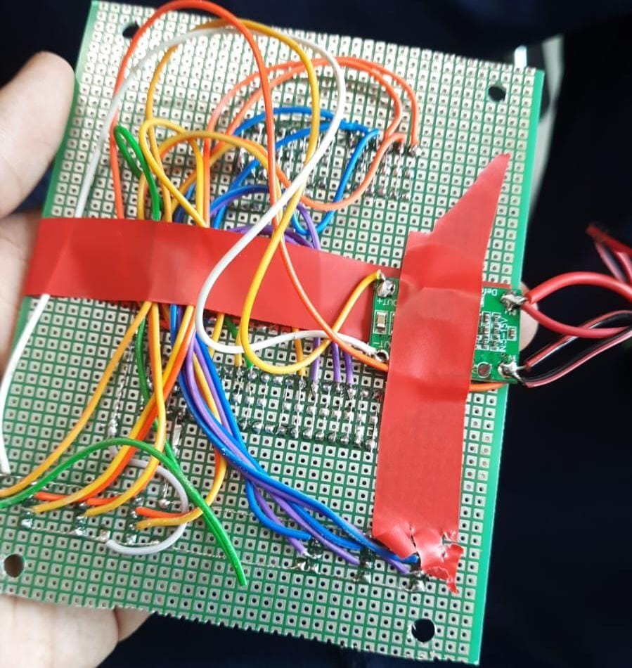

Engineering material
====


<p align="center">
  
</p>

This repository contains engineering material of a self-driven vehicle's model participating in the WRO Future Engineers competition in the season 2025.

## Content of Repository

| Folder     | Description |
|------------|-------------|
| `models/`  | 3D-printable mechanical parts (sensor mounts, chassis, etc.) |
| `schemes/` | Electrical schematics and wiring diagrams |
| `src/`     | Python (Raspberry Pi) → Vision, lane following, obstacle avoidance, parking logic.<br>Arduino → Motor + servo bridge (serial protocol for PWM + steering). |
| `t-photos/`| Team photos (includes one official group photo and one funny team photo) |
| `v-photos/`| Vehicle photos (6 angles: front, back, sides, top, bottom) |
| `video/`   | Driving demo link or video files |
| `other/`   | Documentation, datasets, hardware specs, and supporting materials |

---

##  Parts List

| Component                | Quantity | Description / Role                                     |
|--------------------------|----------|--------------------------------------------------------|
| Raspberry Pi 4 (or 3B+)  | 1        | Main controller, runs Python + OpenCV vision + logic   |
| Arduino Uno              | 1        | Low-level controller for motor + steering (PWM + servo)|
| L293D / TB6612 Driver    | 1        | Motor driver IC for DC motor control                   |
| DC Gear Motor            | 1        | Rear wheel drive motor                                 |
| Servo Motor (MG996R)     | 1        | Steering actuator (mounted on front axle)              |
| HC-SR04 Ultrasonic Sensor| 6        | Obstacle detection (front, back, left, right, FL, FR)  |
| Li-on Battery 12V        | 1        | Power source for electronics and motors                |
| Motor Mounts / Chassis   | 1 set    | 3D-printed chassis parts + mounts                      |
| Wheels + Tires           | 2–4      | Drive + steering wheels                                |
| Wires, Jumper cables     | —        | Connections between Pi, Arduino, sensors, and driver   |
| Breadboard / PCB         | 1        | For stable wiring and connections                      |
| Camera (Pi Camera / USB) | 1        | Used by Raspberry Pi for lane + obstacle detection     |
| Motor 12v DC             | 1        | For Moving the robot (connected to single axle)     |

<!-- Parts Gallery -->
<h2> Photos of parts</h2>

<table>
  <tr>
    <td align="center">
      <br/>
      <sub><b>PCB</b></sub>
    </td>
    <td align="center">
      <br/>
      <sub><b>Ball Bearing 1</b></sub>
    </td>
    <td align="center">
      <br/>
      <sub><b>Ball Bearing 2</b></sub>
    </td>
    <td align="center">
      <br/>
      <sub><b>Motor Shield</b></sub>
    </td>
  </tr>
</table>

## Team members

Ayan Atmakuri, age 16, atmakuriayan@gmail.com 
(Raspberry Pi Programming)

Kushal Khemani, age 16, kushal.khemani@gmail.com
(Arduino Programming, 3D Modeling, Building, PCB)

## Team Photos

 

Ayan Atmakuri (Purple shirt), Kushal Khemani (Grey shirt with green collar)

##  Quick Overview

A vision-guided mini-vehicle using:

- **Raspberry Pi**: Computer vision (OpenCV), control logic (PD + FSM)  
- **Arduino Uno**: Motor and servo actuation, obstacle feedback  
- **Simple Serial Protocol**: Commands like `M <int>`, `SUS <us>`, `STOP`, `PING`  
- **Features**: Lane following, obstacle avoidance, auto-parking, HSV tuning, simulator.

# Introduction

This repository hosts the software and wiring for an autonomous robot car built for the **World Robot Olympiad 2025 – Future Engineers Challenge**.

The design leverages a **Raspberry Pi** for high-level perception and decision-making—handling lane detection, obstacle avoidance, color-coded behavior (e.g., pass red on the right, green on the left), and vision-guided parking—while an **Arduino Uno** handles real-time actuation of the DC drive motor and steering servo based on those decisions. This documentation provided a step-by-step process on how you can implement your own robot.

### System Workflow - We use this to set ground rules

1. **Vision & Perception (Raspberry Pi)**  
   - Captures camera frames and processes them for road lanes, colored markers, and parking bays.  
   - Runs a state machine with PD control logic, lap counting, and parking alignment commands.

2. **Control Communication**  
   - Sends steering (e.g., servo angle) and throttle (motor PWM) commands via serial to the Arduino.

3. **Motion Execution (Arduino)**  
   - Receives commands and outputs PWM for the motor driver (L293D/TB6612) and servo control for steering.

4. **Real World Performance**  
   - Car autonomously navigates laps, avoids obstacles, obeys color-based passing rules, executes turnarounds, and completes vision-guided parallel parking.


## 1. Mobility Management - finding what suits best 

Our vehicle’s mobility system has been engineered for robust, stable navigation across both Open and Obstacle Challenges in WRO 2025. The setup balances power, control precision, and sensor integration using reliable, competition-grade components.

### Motor Selection and Implementation

We selected a **12V DC gear motor rated at 300 RPM** for propulsion. The decision was based on:

* **High torque output**, necessary for low-speed maneuvers and quick directional changes
* Sufficient RPM to maintain speed while tracking lines or navigating walls
* Compatibility with the **L293D motor driver shield**, which allows:

  * PWM-based speed control via **digital pin D11**
  * Direction control via built-in 74HC595 shift register (internal use of D4, D7, D8, D12)

Only **Motor M1** on the shield is used, simplifying wiring and reducing interference with ultrasonic TRIG/ECHO pins.

### Steering Mechanism

Steering is handled by an **MG996R high-torque servo motor**, chosen for its:

* **Superior torque (up to 10kg.cm)**, ideal for precise control of front-wheel pivot steering
* Robust metal gears suitable for extended use and minor shocks
* Faster response time compared to standard 9g hobby servos

The servo is powered via a **dedicated buck converter set at 5V**, ensuring:

* Stable power supply without drawing current from the Arduino
* Protection against brownout during high-load movements

The servo signal is connected to **digital pin D9** and is controlled via the `Servo.h` library.

### Chassis and Component Mounting

The chassis is a **custom design** with cutouts and supports for:

* Arduino Uno + L293D Shield (stacked)
* Servo motor mounted at the front axle for steering
* Power bank or Li-ion battery for 12V supply
* Buck converter securely fixed for servo
* Ultrasonic sensors (6x) around the perimeter

The mounting design ensures:

* **Center of gravity remains low**, aiding stability
* **Balanced front-rear weight** to avoid drift or oversteer
* **Mechanical isolation** for sensor mounts to avoid vibration interference

### Engineering Principles Applied

* **Torque over speed**: The 300 RPM motor offers sufficient torque for all obstacle scenarios and allows smooth lap completion.
* **Proportional control via PWM** for both speed and steering adjustments.
* **Power isolation**: Servo draws from a separate buck, preventing logic voltage drops on Arduino.

Failsafe routines in the software monitor obstacle proximity. If all sensor readings drop below safe limits, the car **automatically reverses and adjusts angle** to prevent collision or deadlock.


## 2. Power and Sense Management - trying to be energy efficient

To enable robust autonomous operation across both the Open and Obstacle Challenges, our power and sensing systems were designed to be modular, efficient, and fail-safe. Key design goals included isolating high-power and logic domains, ensuring consistent voltage supply for sensitive components, and providing wide-angle situational awareness through sensor fusion.

---

### Power Management

#### Power Source:

The entire vehicle is powered by a **12V Li-ion battery**, chosen for its:

* High energy density
* Lightweight form factor
* Rechargeability
* Ability to sustain current surges required by motors and electronics

The battery feeds both high-power components and regulated subsystems via a **step-down (buck) converter**.

#### Voltage Regulation:

* **DC Motor (12V)**: Powered directly from the battery through an L293D motor shield.
* **Servo Motor (MG996R, 5V)**: Powered via a dedicated buck converter to ensure stable current and prevent voltage dips under load.
* **Arduino Uno & Logic Circuits**: Supplied via the 5V rail, either from USB or regulated output from the buck.
* **Raspberry Pi** (Obstacle Challenge): Powered separately or through a second buck converter, ensuring isolation from motor spikes.

This separation of power rails helps avoid brownouts, particularly during servo actuation or rapid motor speed changes. A common ground is maintained to ensure reliable sensor readings.

#### Safety Features:

* On/off switch to isolate the main supply
* Fuse protection inline with the Li-ion output
* Reverse polarity and surge protection via onboard diode


###  Sense Management

#### Sensor System:

The vehicle uses **six ultrasonic distance sensors (HC-SR04)** strategically positioned to cover:

* Forward path detection
* Side wall following and obstacle clearance
* Rear proximity awareness

These sensors were selected based on:

* Proven reliability and accuracy (2–400 cm range)
* Low cost and easy integration with Arduino
* Minimal power consumption (\~15 mA per sensor)

#### Sensor Strategy:

* **Open Challenge**: The sensors guide wall-following behavior and lap-count detection using distance thresholds and orientation cues.
* **Obstacle Challenge**: The sensors serve as secondary proximity detection, while the **Raspberry Pi + camera** handles traffic signs, colored zones, and advanced navigation through computer vision.

#### Power Consumption Considerations:

All sensors operate on 5V logic. Since each sensor draws minimal current, they are powered directly from the Arduino 5V output. The servo's power-hungry nature warranted a dedicated 5V supply via buck converter to avoid interference.


## 3. Obstacle Management - the main challenge

Obstacle management in our self-driving vehicle focuses on real-time detection, decision-making, and recovery strategies to navigate both static and dynamic obstacles with minimal latency and high reliability.

The only solution - a **hybrid approach**:

* **Ultrasonic sensors (Arduino-controlled)** for reactive proximity-based obstacle avoidance
* **Camera + Raspberry Pi (OpenCV)** for computer vision tasks such as detecting stop signs, colored zones, and “No Entry” paths

---

### Strategy Overview - what we found after a few long discussions

#### **Open Challenge (Arduino-only):**

* Use ultrasonic sensors to detect walls and gaps
* Follow the left wall to maintain direction
* Avoid close-range collisions using threshold values
* Perform a lap-count using sensor fusion
* Maintain consistent motion unless a fail-safe triggers

#### **Obstacle Challenge (Raspberry Pi + Arduino):**

* Raspberry Pi processes camera input for traffic sign recognition
* On detecting a STOP sign, Pi sends a signal to Arduino to pause
* If a colored zone or arrow sign is detected, Pi sends directional decisions
* Arduino reacts with real-time motor and steering commands
* Failsafes include “no echo” situations, timeout recovery, and realignment

---

### Flow Diagram - easy to interpret

```
[Start]
   |
   v
[Sensor Calibration]
   |
   v
[Wall Following Enabled] ←-------------------------\
   |                                              |
   v                                              |
[Obstacle Detected?] --Yes--> [Decision: Stop/Turn/Slow]
   |                                              |
  No                                              v
   |                                  [Resume Wall Following]
   v                                              |
[Zone Entry Detected?] --Yes--> [Trigger Zone Handling Logic]
   |                                              |
  No                                              v
   |                                  [Lap Count or Finish?]
   v                                              |
[Continue Movement] -----------------------------/
```

---

### Pseudocode (Obstacle Challenge) - we learnt this last year

```plaintext
Start
→ Initialize Arduino and Pi communication
→ Start camera stream and ultrasonic sensors
→ While lap count < 3:
    - Use ultrasonic sensors for wall following
    - If front obstacle distance < 15 cm:
        - Stop or steer away
    - If Pi detects STOP sign:
        - Pause 3 seconds
    - If Pi detects “turn right”:
        - Send servo signal to turn
    - If Pi detects color zone:
        - Change speed / behavior
→ After 3 laps, stop car
```

---

### Arduino Code Snippet (Obstacle Handling Logic) - OOP

// Inside loop()

```cpp
long distFC = readDistance(TRIG_FC, ECHO_FC);
long distL = readDistance(TRIG_L, ECHO_L);
long distR = readDistance(TRIG_R, ECHO_R);

// Wall following logic
if (distL < 15) {
  turnRight();
} else if (distL > 30) {
  turnLeft();
} else {
  goStraight();
}

// Obstacle ahead
if (distFC < 12) {
  stopCar();
  delay(800);
  turnRight();  // Basic evasive action
  delay(400);
}
```

---

### Raspberry Pi Role (Computer Vision)

The Pi runs OpenCV-based code to:

* Detect red signs
* Recognize arrows for directional instructions
* Identify colored zones using HSV masks

After classification, the Pi sends command signals to Arduino via serial:

* `"STOP"`, `"LEFT"`, `"RIGHT"`, etc.

The Arduino interprets these and adjusts movement accordingly.

---

### Failsafe Mechanisms

* **No echo recovery**: If no echo is received from a sensor for more than 3 reads, the car slows down and centers.
* **Stuck detection**: If the car hasn't moved in distance (based on rear sensors), it reverses for 1 second and retries.
* **Soft timeout**: If a lap takes longer than 2 minutes, the system logs an alert.
* **Reversing**: The car reverses if it is less than 15 cm from an obstacle.


# Arduino Pin Mapping for Self-Driving Car (WRO 2025) 

**This is what we decided upon...**

### 🔧 Motor (M1 via L293D Shield)
- **Speed (PWM):** `D11`  
- **Direction:** Handled internally by the shield’s 74HC595  
  *(Uses internal pins D4, D7, D8, D12 — do not control directly)*

---

### Servo Motor
- **Signal Pin:** `D9`

---

### Ultrasonic Sensors (6 Total)
> Echo lines are placed on analog pins `A0–A5` for cleaner signal and to free digital pins.  
> Trigger lines are assigned to available digital pins.


# Unit Testing For Arduino

These are standalone Arduino sketches to test individual subsystems (servo, motor, ultrasonic sensors) before integrating them together.  
Each can be copied into the Arduino IDE and uploaded separately.


### 1) Servo Sweep (D9)

Moves the steering **servo** smoothly from 0°→180°→0°.  
**Important:** MG996R needs its own 5–6 V supply (≥3 A). Do not power from the Arduino 5 V pin.
Errors I made - did not use a buck converter to supply constant voltage and amps. This caused stuttering in the steering.

```cpp
#include <Servo.h>

Servo myServo;

void setup() {
  myServo.attach(9);   // Servo signal on D9 (power from external 5–6 V)
}

void loop() {
  // Sweep 0° -> 180°
  for (int pos = 0; pos <= 180; pos += 5) {
    myServo.write(pos);
    delay(50);
  }
  // Sweep back 180° -> 0°
  for (int pos = 180; pos >= 0; pos -= 5) {
    myServo.write(pos);
    delay(50);
  }
}

```
### 2) DC Motor on L293D Shield (M1)

Drives the M1 motor channel forward, stop, reverse, stop.

Note: generic L293D shields vary. This code assumes M1_DIR on D12 and M1_PWM on D3.
If your shield uses different pins, update the defines.
Errors I made - used the pins on the arduino that the motor shield was dependent on.
```cpp
// Test Motor at M1 on L293D Shield
int M1_DIR = 12;  // Direction pin for M1 (check your shield!)
int M1_PWM = 3;   // PWM pin for M1 speed

void setup() {
  pinMode(M1_DIR, OUTPUT);
  pinMode(M1_PWM, OUTPUT);
}

void loop() {
  // Forward
  digitalWrite(M1_DIR, HIGH);
  analogWrite(M1_PWM, 200);  // Speed (0-255)
  delay(2000);

  // Stop
  analogWrite(M1_PWM, 0);
  delay(1000);

  // Reverse
  digitalWrite(M1_DIR, LOW);
  analogWrite(M1_PWM, 200);
  delay(2000);

  // Stop
  analogWrite(M1_PWM, 0);
  delay(1000);
}
```  
### 3) Six Ultrasonic Sensors (HC-SR04)

Reads Front, Back, Left, Right, Diagonal-Front-Left, Diagonal-Front-Right.
All sensors share VCC → 5 V and GND → GND, each has its own TRIG/ECHO pins.
Errors I made - connecting the trig pins in one digital pin (for sequential reading). This made the program complex and led to crashing.
```cpp
// ------------------- Pin mappings -------------------
// ---- Ultrasonic Sensors ----
struct Ultrasonic {
  uint8_t trigPin;
  uint8_t echoPin;
  const char* name;
};

// Define all sensors with mapping
Ultrasonic sensors[] = {
  {2,  A0, "Front-Center"},
  {3,  A1, "Front-Left Diagonal"},
  {5,  A2, "Front-Right Diagonal"},
  {6,  A3, "Left"},
  {10, A4, "Right"},
  {13, A5, "Back"}
};

long getDistance(uint8_t trigPin, uint8_t echoPin) {
  // Send trigger pulse
  digitalWrite(trigPin, LOW);
  delayMicroseconds(2);
  digitalWrite(trigPin, HIGH);
  delayMicroseconds(10);
  digitalWrite(trigPin, LOW);

  // Read echo time
  long duration = pulseIn(echoPin, HIGH, 20000); // timeout = 20ms (~3.4m range)

  // Convert to distance in cm
  long distance = duration * 0.034 / 2;
  return distance;
}

void setup() {
  Serial.begin(9600);

  // Initialize pins
  for (auto &s : sensors) {
    pinMode(s.trigPin, OUTPUT);
    pinMode(s.echoPin, INPUT);
  }

  Serial.println("Ultrasonic Sensor Test Started...");
}

void loop() {
  for (auto &s : sensors) {
    long d = getDistance(s.trigPin, s.echoPin);
    Serial.print(s.name);
    Serial.print(": ");
    if (d == 0) Serial.println("Out of range");
    else Serial.print(d), Serial.println(" cm");
  }

  Serial.println("--------------------");
  delay(500); // wait before next reading
}

```  
🥳 Gotchas

Servo power: MG996R is high-torque; use a separate 5–6 V buck (≥3–5 A).

Motor shield pinouts: Check your shield silkscreen; some use D11/D3 for M1.

Grounding: Arduino GND, motor shield GND, buck GND, servo GND, and sensor GND must all be connected together.

Ultrasonic max range: 400 cm in the serial monitor means “no object detected.”

### 4) Modular Testing Code - because why not.
This code will involve all components required to run the robot in the first round.

It’s menu-driven over the Serial Monitor:

Press 1 → Servo sweep test

Press 2 → Motor forward/stop/reverse test

Press 3 → Live ultrasonic scan (all six)

Press 4 → Simple safety drive (forward, stop if front < 25 cm)

Press s → Stop motor immediately

Press h → Help menu

```cpp
/*
  Modular Test Suite: Motor (L293D M1) + Servo (D10) + 6x Ultrasonic
  - Board: Arduino Uno + Generic L293D Motor Shield
  - Motor: M1 (AFMotor abstracts shield pins)
  - Servo: MG996R signal on D10 (POWER FROM 5–6 V BUCK, not Arduino 5V!)
  - Ultrasonic: 6x HC-SR04, shared 5V/GND, individual TRIG/ECHO pins

  Controls (Serial Monitor @115200, "No line ending"):
    1 : Servo sweep
    2 : Motor test (FWD, STOP, REV)
    3 : Ultrasonic live scan (all 6)
    4 : Safety drive (forward; stop if front < 25 cm)
    s : Stop motor now
    h : Help
*/

#include <AFMotor.h>
#include <Servo.h>

// ------------------- Motor (L293D shield, M1) -------------------
AF_DCMotor motor1(1);   // M1 port on the shield

// ------------------- Servo (signal on D10) ----------------------
Servo steering;
const int SERVO_PIN = 10;
const int SERVO_CENTER = 90;
const int SERVO_SWEEP = 40; // ±40° from center

// ------------------- Ultrasonic pins ----------------------------
#define TRIG_F   2
#define ECHO_F   4

#define TRIG_B   5
#define ECHO_B   6

#define TRIG_L   7
#define ECHO_L   8

#define TRIG_R   A0   // D14
#define ECHO_R   A1   // D15

#define TRIG_DFL A2   // D16
#define ECHO_DFL A3   // D17

#define TRIG_DFR A4   // D18
#define ECHO_DFR A5   // D19

// ------------------- Modes --------------------------------------
enum Mode : uint8_t {
  IDLE = 0,
  SERVO_SWEEP_MODE,
  MOTOR_TEST_MODE,
  ULTRA_SCAN_MODE,
  SAFETY_DRIVE_MODE
};

Mode mode = IDLE;

// ------------------- Helpers ------------------------------------
long readDistanceCM(int trigPin, int echoPin) {
  digitalWrite(trigPin, LOW);
  delayMicroseconds(2);
  digitalWrite(trigPin, HIGH);
  delayMicroseconds(10);
  digitalWrite(trigPin, LOW);

  unsigned long duration = pulseIn(echoPin, HIGH, 30000UL); // timeout 30ms
  if (duration == 0) return 400; // no echo within window
  return duration / 58;          // µs → cm
}

struct Distances {
  long F, B, L, R, DFL, DFR;
};

Distances readAll() {
  Distances d;
  d.F   = readDistanceCM(TRIG_F,   ECHO_F);
  d.B   = readDistanceCM(TRIG_B,   ECHO_B);
  d.L   = readDistanceCM(TRIG_L,   ECHO_L);
  d.R   = readDistanceCM(TRIG_R,   ECHO_R);
  d.DFL = readDistanceCM(TRIG_DFL, ECHO_DFL);
  d.DFR = readDistanceCM(TRIG_DFR, ECHO_DFR);
  return d;
}

void printAll(const Distances& d) {
  Serial.print("F: ");   Serial.print(d.F);   Serial.print("  ");
  Serial.print("B: ");   Serial.print(d.B);   Serial.print("  ");
  Serial.print("L: ");   Serial.print(d.L);   Serial.print("  ");
  Serial.print("R: ");   Serial.print(d.R);   Serial.print("  ");
  Serial.print("DFL: "); Serial.print(d.DFL); Serial.print("  ");
  Serial.print("DFR: "); Serial.println(d.DFR);
}

// ------------------- Motor control wrappers ---------------------
void motorStop() {
  motor1.run(RELEASE);
}

void motorForward(uint8_t speed255) {
  motor1.setSpeed(speed255);
  motor1.run(FORWARD);
}

void motorBackward(uint8_t speed255) {
  motor1.setSpeed(speed255);
  motor1.run(BACKWARD);
}

// ------------------- UI -----------------------------------------
void printHelp() {
  Serial.println(F("\n=== Test Suite Controls ==="));
  Serial.println(F("1 : Servo sweep"));
  Serial.println(F("2 : Motor test (forward/stop/reverse)"));
  Serial.println(F("3 : Ultrasonic live scan"));
  Serial.println(F("4 : Safety drive (stop if front < 25 cm)"));
  Serial.println(F("s : Stop motor"));
  Serial.println(F("h : Help\n"));
}

void setMode(Mode m) {
  mode = m;
  switch (mode) {
    case IDLE:               Serial.println(F("[MODE] IDLE")); break;
    case SERVO_SWEEP_MODE:   Serial.println(F("[MODE] SERVO SWEEP")); break;
    case MOTOR_TEST_MODE:    Serial.println(F("[MODE] MOTOR TEST")); break;
    case ULTRA_SCAN_MODE:    Serial.println(F("[MODE] ULTRASONIC SCAN")); break;
    case SAFETY_DRIVE_MODE:  Serial.println(F("[MODE] SAFETY DRIVE")); break;
  }
}

// ------------------- Setup --------------------------------------
void setup() {
  Serial.begin(115200);

  // Servo
  steering.attach(SERVO_PIN);
  steering.write(SERVO_CENTER);

  // Motor
  motorStop();           // ensure stopped
  motor1.setSpeed(0);

  // Ultrasonic pinModes
  pinMode(TRIG_F, OUTPUT);   pinMode(ECHO_F, INPUT);
  pinMode(TRIG_B, OUTPUT);   pinMode(ECHO_B, INPUT);
  pinMode(TRIG_L, OUTPUT);   pinMode(ECHO_L, INPUT);
  pinMode(TRIG_R, OUTPUT);   pinMode(ECHO_R, INPUT);
  pinMode(TRIG_DFL, OUTPUT); pinMode(ECHO_DFL, INPUT);
  pinMode(TRIG_DFR, OUTPUT); pinMode(ECHO_DFR, INPUT);

  printHelp();
  setMode(IDLE);
}

// ------------------- Mode state vars ----------------------------
unsigned long t0 = 0;
int sweepDir = +1;
int servoPos = SERVO_CENTER;

// For motor test steps
uint8_t motorStep = 0;
unsigned long motorTimer = 0;

// ------------------- Loop ---------------------------------------
void loop() {
  // ---- Serial command handling ----
  if (Serial.available()) {
    char c = Serial.read();
    if (c == '1') setMode(SERVO_SWEEP_MODE);
    else if (c == '2') { motorStep = 0; motorTimer = 0; setMode(MOTOR_TEST_MODE); }
    else if (c == '3') setMode(ULTRA_SCAN_MODE);
    else if (c == '4') setMode(SAFETY_DRIVE_MODE);
    else if (c == 's') { motorStop(); Serial.println(F("[MOTOR] STOP")); }
    else if (c == 'h') printHelp();
  }

  // ---- Mode behaviors ----
  switch (mode) {
    case IDLE: {
      // idle: keep things safe
      motorStop();
      steering.write(SERVO_CENTER);
    } break;

    case SERVO_SWEEP_MODE: {
      // Non-blocking sweep: update every 20 ms
      unsigned long now = millis();
      if (now - t0 >= 20) {
        t0 = now;
        servoPos += sweepDir * 2;  // speed of sweep
        if (servoPos >= SERVO_CENTER + SERVO_SWEEP) { servoPos = SERVO_CENTER + SERVO_SWEEP; sweepDir = -1; }
        if (servoPos <= SERVO_CENTER - SERVO_SWEEP) { servoPos = SERVO_CENTER - SERVO_SWEEP; sweepDir = +1; }
        steering.write(servoPos);
      }
    } break;

    case MOTOR_TEST_MODE: {
      // Step through: FWD 2s → STOP 1s → REV 2s → STOP 1s → repeat
      unsigned long now = millis();
      if (motorStep == 0) {
        motorForward(200);
        Serial.println(F("[MOTOR] FORWARD @200"));
        motorTimer = now;
        motorStep = 1;
      } else if (motorStep == 1 && now - motorTimer >= 2000) {
        motorStop();
        Serial.println(F("[MOTOR] STOP"));
        motorTimer = now;
        motorStep = 2;
      } else if (motorStep == 2 && now - motorTimer >= 1000) {
        motorBackward(200);
        Serial.println(F("[MOTOR] BACKWARD @200"));
        motorTimer = now;
        motorStep = 3;
      } else if (motorStep == 3 && now - motorTimer >= 2000) {
        motorStop();
        Serial.println(F("[MOTOR] STOP"));
        motorTimer = now;
        motorStep = 4;
      } else if (motorStep == 4 && now - motorTimer >= 1000) {
        motorStep = 0; // loop again
      }
    } break;

    case ULTRA_SCAN_MODE: {
      // Print all sensor distances ~10 Hz
      static unsigned long lastPrint = 0;
      unsigned long now = millis();
      if (now - lastPrint >= 100) {
        lastPrint = now;
        Distances d = readAll();
        printAll(d);
      }
    } break;

    case SAFETY_DRIVE_MODE: {
      // Drive forward slowly; stop if front < 25 cm
      static unsigned long lastChk = 0;
      unsigned long now = millis();
      if (now - lastChk >= 100) {
        lastChk = now;
        long f = readDistanceCM(TRIG_F, ECHO_F);
        Serial.print(F("Front(cm): ")); Serial.println(f);
        if (f < 25) {
          motorStop();
          Serial.println(F("[SAFETY] Obstacle close → STOP"));
        } else {
          motorForward(140); // gentle cruise
        }
      }
      // Keep servo centered during this simple test
      steering.write(SERVO_CENTER);
    } break;
  }
}


```

  Wiring Notes:
  - Motor: connect to M1 on L293D shield; supply 6–12 V to shield VM/EXT PWR; GND common with Arduino.
  - Servo: D10 signal; POWER from separate 5–6 V buck (≥3–5 A). Tie buck GND to Arduino GND.
  - Ultrasonic: All VCC → 5 V, all GND → GND. TRIG/ECHO as defined above.
  - Common Ground: Battery –, shield GND, Arduino GND, both buck GNDs, sensor GND, servo GND MUST be common.


# Arduino Code – Square Track 3-Lap Challenge

This Arduino code powers a self-driving robot car to autonomously complete **3 laps on a square track** that contains both **interior and exterior walls**. It uses **6 ultrasonic sensors** to detect obstacles and implements a **left-wall-following algorithm** for navigation.

---

## Navigation Strategy

- **Wall Following Rule:** Left-hand rule – always keep the left wall within a specific distance range.
- **Obstacle Avoidance:** Uses `Front-Center`, `Left`, and `Right` sensors to detect and steer around walls.
- **Lap Detection:** When the robot re-enters a specific sensor pattern near the start zone (e.g., wall in front but no wall on left), a lap is counted.
- **Goal:** Complete 3 full laps and stop.

---

## Pin Configuration

| Component             | TRIG (Digital) | ECHO (Analog) |
|----------------------|----------------|---------------|
| Front-Center (FC)    | D2             | A0            |
| Front-Left Diagonal  | D3             | A1            |
| Front-Right Diagonal | D5             | A2            |
| Left (L)             | D6             | A3            |
| Right (R)            | D10            | A4            |
| Back (B)             | D13            | A5            |

- **Motor (M1):** PWM on D11 (Direction handled by L293D shield)
- **Servo:** Signal on D9

---

## Arduino Code with Explanation

### 1. Pin Mapping and Includes

We define all the pin assignments and include the Servo library to control the steering mechanism.

```cpp
#define TRIG_FC 2
#define ECHO_FC A0
#define TRIG_FLD 7
#define ECHO_FLD A1
#define TRIG_FRD 8
#define ECHO_FRD A2
#define TRIG_L 10
#define ECHO_L A3
#define TRIG_R 12
#define ECHO_R A4
#define TRIG_B 13
#define ECHO_B A5

#define MOTOR_PWM 11
#define SERVO_PIN 9
#define STBY 4 // used internally by the shield

#include <Servo.h>
````

---

### 2. Global Variables and Distance Reader

* `lapCount`: Tracks completed laps.
* `inStartZone`: Used to avoid double-counting laps.
* `readDistance()`: Generic ultrasonic reader using TRIG/ECHO logic.

```cpp
Servo steering;

int lapCount = 0;
bool inStartZone = false;
unsigned long lastLapTime = 0;

long readDistance(int trigPin, int echoPin) {
  digitalWrite(trigPin, LOW); delayMicroseconds(2);
  digitalWrite(trigPin, HIGH); delayMicroseconds(10);
  digitalWrite(trigPin, LOW);

  long duration = pulseIn(echoPin, HIGH, 30000); // 30ms timeout
  if (duration == 0) return 400;
  return duration / 58;
}
```

---

### 3. Basic Movement Commands

These functions control the car's direction and speed using the motor and servo.

```cpp
void moveForward() {
  analogWrite(MOTOR_PWM, 180);  // Set motor speed
}

void turnLeft() {
  steering.write(120);  // Servo turn left
}

void turnRight() {
  steering.write(60);   // Servo turn right
}

void goStraight() {
  steering.write(90);   // Servo center
}

void stopCar() {
  analogWrite(MOTOR_PWM, 0);  // Stop motor
}
```

---

### 4. Setup Routine

Sets pin modes and prepares the motor and servo.

```cpp
void setup() {
  Serial.begin(9600);

  pinMode(TRIG_FC, OUTPUT); pinMode(ECHO_FC, INPUT);
  pinMode(TRIG_FLD, OUTPUT); pinMode(ECHO_FLD, INPUT);
  pinMode(TRIG_FRD, OUTPUT); pinMode(ECHO_FRD, INPUT);
  pinMode(TRIG_L, OUTPUT); pinMode(ECHO_L, INPUT);
  pinMode(TRIG_R, OUTPUT); pinMode(ECHO_R, INPUT);
  pinMode(TRIG_B, OUTPUT); pinMode(ECHO_B, INPUT);

  pinMode(MOTOR_PWM, OUTPUT);
  steering.attach(SERVO_PIN);
  goStraight();  // Default orientation
}
```

---

### 5. Main Navigation Loop

The loop reads distances and makes steering decisions. It also monitors lap count based on a “start zone” condition.

```cpp
void loop() {
  long distFC = readDistance(TRIG_FC, ECHO_FC);
  long distL = readDistance(TRIG_L, ECHO_L);
  long distR = readDistance(TRIG_R, ECHO_R);
```

#### Lap Detection Logic

This logic ensures that a lap is only counted when the robot passes through a specific condition: wall ahead but no left wall.

```cpp
  if (distFC < 20 && distL > 50 && (millis() - lastLapTime > 3000)) {
    if (!inStartZone) {
      lapCount++;
      Serial.print("Lap Completed: "); Serial.println(lapCount);
      lastLapTime = millis();
      inStartZone = true;
    }
  } else if (distFC > 30) {
    inStartZone = false;
  }
```

#### Wall-Following Steering

Uses distance from the left wall to steer the car.

```cpp
  if (distL < 15) {
    turnRight();  // Too close to wall
  } else if (distL > 30) {
    turnLeft();   // Too far from wall
  } else {
    goStraight();
  }

  moveForward();  // Keep moving
```

#### Stop After 3 Laps

```cpp
  if (lapCount >= 3) {
    stopCar();
    while (true) {
      Serial.println("Mission Complete!");
      delay(1000);
    }
  }

  delay(100);  // Loop pacing
}
```

---

## Customization Tips

| Goal                       | What to Adjust                         |
| -------------------------- | -------------------------------------- |
| More precise turning       | Tune `steering.write()` values         |
| Better lap detection       | Modify `distFC` and `distL` thresholds |
| Change wall-following side | Replace `distL` logic with `distR`     |
| Avoid diagonal corners     | Use FLD / FRD for early turns          |

---

## Optional Enhancements

* Add line sensors or camera for finish line detection
* Use PID for better steering control
* Switch to right-wall following by updating logic

---
FULL CODE (With Revisons)- 
```cpp
/*
  WRO 2025 – Open Challenge
  Full Obstacle Avoidance (Potential-Field Style) + PD Steering & Proportional Speed
  Hardware: Arduino UNO + Adafruit Motor Shield v1 (L293D) + 1x DC Motor (M1) + Servo (D9) + 6x HC-SR04
*/

#include <Servo.h>
#include <AFMotor.h>

// ---------- Pin Map (saved reference) ----------
#define TRIG_FC 2     // Front-Center TRIG
#define ECHO_FC A0
#define TRIG_FLD 3    // Front-Left Diag TRIG
#define ECHO_FLD A1
#define TRIG_FRD 5    // Front-Right Diag TRIG
#define ECHO_FRD A2
#define TRIG_L 6      // Left TRIG
#define ECHO_L A3
#define TRIG_R 10     // Right TRIG
#define ECHO_R A4
#define TRIG_B 13     // Back TRIG
#define ECHO_B A5

#define SERVO_PIN 9   // Steering servo (D9)

// ---------- Hardware ----------
AF_DCMotor motor(1);    // M1 on L293D shield v1
Servo steering;

// ---------- Tunables ----------
const uint16_t ECHO_TIMEOUT_US   = 30000;  // ~5 m

// (1) Faster steering response
const int      MAX_STEER_DEG     = 55;     // was 35
const float    KP_STEER          = 1.7f;   // was 1.2f (P gain)
const float    KD_STEER          = 0.25f;  // (4) D gain (start 0.15–0.35)

// Speed policy
const int      BASE_SPEED        = 220;    // normal speed (0..255) — adjust if needed
const int      MIN_SPEED         = 150;    // minimum forward speed when narrow
const int      REVERSE_SPEED     = 160;    // reverse speed
const int      CLEAR_FAST_CM     = 90;     // >= this ahead -> allow BASE_SPEED
const int      CLEAR_SLOW_CM     = 20;     // <= this ahead -> clamp to MIN_SPEED

// Stops & safety
const int      FRONT_STOP_CM     = 15;     // NEW: stop if FC < 15 cm
const int      HARD_BLOCK_CM     = 14;     // reverse failsafe threshold
const int      SIDE_PUSH_START   = 60;     // start side repulsion within this range

// Repulsion strengths
const float    K_FRONT           = 1.8f;
const float    K_DIAG            = 1.4f;
const float    K_SIDE            = 1.2f;
const float    K_BACK            = 0.9f;

// (2) Faster reaction (less smoothing) & loop timing
const float    ALPHA_SMOOTH      = 0.25f;  // was 0.35f

// Optional: flip motor polarity without rewiring
const bool     INVERT_MOTOR      = false;

// ---------- State (smoothed distances) ----------
float dFCf=200, dFLDf=200, dFRDf=200, dLf=200, dRf=200, dBf=200;

// PD steering state
float prevFy = 0.0f;

// ---------- Helpers ----------
long readDistanceOnce(uint8_t trig, uint8_t echo) {
  pinMode(trig, OUTPUT);
  pinMode(echo, INPUT);

  digitalWrite(trig, LOW);  delayMicroseconds(2);
  digitalWrite(trig, HIGH); delayMicroseconds(10);
  digitalWrite(trig, LOW);

  unsigned long dur = pulseIn(echo, HIGH, ECHO_TIMEOUT_US);
  if (dur == 0) return 400;       // treat as far
  return (long)(dur / 58);        // us -> cm
}

long readDistanceMedian3(uint8_t trig, uint8_t echo) {
  long a = readDistanceOnce(trig, echo);
  long b = readDistanceOnce(trig, echo);
  long c = readDistanceOnce(trig, echo);
  if (a > b) { long t=a; a=b; b=t; }
  if (b > c) { long t=b; b=c; c=t; }
  if (a > b) { long t=a; a=b; b=t; }
  return b;
}

template<typename T>
T clamp(T v, T lo, T hi) { return (v < lo) ? lo : (v > hi) ? hi : v; }

// (3) Microsecond-precision steering for snappier control
void setSteerDeg(int delta) { // -MAX..+MAX relative to center (90°)
  delta = clamp(delta, -MAX_STEER_DEG, MAX_STEER_DEG);
  const int center_us = 1500;
  const float us_per_deg = 11.0f;     // tune if needed (10–12 typical)
  int pulse = center_us + (int)(delta * us_per_deg);
  steering.writeMicroseconds(clamp(pulse, 1000, 2000));
}

void driveForward(uint8_t spd) {
  motor.setSpeed(spd);
  if (INVERT_MOTOR) motor.run(BACKWARD);
  else              motor.run(FORWARD);
}

void driveBackward(uint8_t spd) {
  motor.setSpeed(spd);
  if (INVERT_MOTOR) motor.run(FORWARD);
  else              motor.run(BACKWARD);
}

void driveStop() {
  motor.setSpeed(0);
  motor.run(RELEASE);
}

// Stop → steer away → avoidance maneuver (reverse+arc forward)
void stopSteerAndAvoid(bool preferRight) {
  driveStop();
  setSteerDeg(preferRight ? +MAX_STEER_DEG : -MAX_STEER_DEG);
  delay(120);                          // short settle while stopped

  // Back out a bit
  driveBackward(REVERSE_SPEED);
  delay(300);

  // Arc forward away from obstacle
  driveForward(MIN_SPEED);
  delay(350);

  // Straighten for resume
  setSteerDeg(0);
}

// Linear map with clamp for speed
int mapToSpeed(long clear_cm) {
  if (clear_cm <= CLEAR_SLOW_CM) return MIN_SPEED;
  if (clear_cm >= CLEAR_FAST_CM) return BASE_SPEED;
  float t = float(clear_cm - CLEAR_SLOW_CM) / float(CLEAR_FAST_CM - CLEAR_SLOW_CM);
  int spd = (int)(MIN_SPEED + t * (BASE_SPEED - MIN_SPEED));
  return clamp(spd, MIN_SPEED, BASE_SPEED);
}

// Compute repulsion magnitude given distance and range
float repulse(float d_cm, float range_cm, float k) {
  if (d_cm >= range_cm) return 0.0f;
  float s = 1.0f - (d_cm / range_cm);
  if (s < 0) s = 0;
  return k * s; // smooth, bounded
}

// ---------- Setup ----------
void setup() {
  Serial.begin(115200);

  steering.attach(SERVO_PIN);
  setSteerDeg(0);

  motor.setSpeed(0);
  motor.run(RELEASE);

  // Initial reads to seed filters
  dFCf  = readDistanceMedian3(TRIG_FC,  ECHO_FC);
  dFLDf = readDistanceMedian3(TRIG_FLD, ECHO_FLD);
  dFRDf = readDistanceMedian3(TRIG_FRD, ECHO_FRD);
  dLf   = readDistanceMedian3(TRIG_L,   ECHO_L);
  dRf   = readDistanceMedian3(TRIG_R,   ECHO_R);
  dBf   = readDistanceMedian3(TRIG_B,   ECHO_B);
}

// ---------- Main Loop ----------
void loop() {
  // 1) Read & smooth distances
  long dFC  = readDistanceMedian3(TRIG_FC,  ECHO_FC);
  long dFLD = readDistanceMedian3(TRIG_FLD, ECHO_FLD);
  long dFRD = readDistanceMedian3(TRIG_FRD, ECHO_FRD);
  long dL   = readDistanceMedian3(TRIG_L,   ECHO_L);
  long dR   = readDistanceMedian3(TRIG_R,   ECHO_R);
  long dB   = readDistanceMedian3(TRIG_B,   ECHO_B);

  dFCf  = ALPHA_SMOOTH * dFC  + (1 - ALPHA_SMOOTH) * dFCf;
  dFLDf = ALPHA_SMOOTH * dFLD + (1 - ALPHA_SMOOTH) * dFLDf;
  dFRDf = ALPHA_SMOOTH * dFRD + (1 - ALPHA_SMOOTH) * dFRDf;
  dLf   = ALPHA_SMOOTH * dL   + (1 - ALPHA_SMOOTH) * dLf;
  dRf   = ALPHA_SMOOTH * dR   + (1 - ALPHA_SMOOTH) * dRf;
  dBf   = ALPHA_SMOOTH * dB   + (1 - ALPHA_SMOOTH) * dBf;

  // 2) Immediate STOP zone: if very close in front, stop then avoid
  if (dFCf < FRONT_STOP_CM) {
    bool freerRight = (dRf > dLf);     // turn toward open side
    stopSteerAndAvoid(freerRight);
    delay(20);
    return;
  }

  // 3) Failsafe: if front + both diagonals are tight, reverse+avoid
  if (dFCf < HARD_BLOCK_CM || (dFLDf < HARD_BLOCK_CM && dFRDf < HARD_BLOCK_CM)) {
    bool freerRight = (dRf > dLf);
    stopSteerAndAvoid(freerRight);
    delay(20);
    return;
  }

  // 4) Potential-field style repulsion vectors
  // Bearings: FC=0°, FLD=+45°, FRD=-45°, L=+90°, R=-90°, B=180°
  float Fx = 0, Fy = 0;

  float fFC  = repulse(dFCf,  CLEAR_FAST_CM, K_FRONT);
  Fx += -fFC;

  float fFLD = repulse(dFLDf, CLEAR_FAST_CM, K_DIAG);
  float fFRD = repulse(dFRDf, CLEAR_FAST_CM, K_DIAG);
  const float c45 = 0.70710678f;
  Fx += -fFLD * c45;   Fy += -fFLD * c45;   // away from +45°
  Fx += -fFRD * c45;   Fy += +fFRD * c45;   // away from -45°

  float fL = repulse(dLf, SIDE_PUSH_START, K_SIDE);
  float fR = repulse(dRf, SIDE_PUSH_START, K_SIDE);
  Fy += -fL;  // left sensor pushes right
  Fy += +fR;  // right sensor pushes left

  float fB = repulse(dBf, SIDE_PUSH_START, K_BACK);
  Fx += +fB;

  // 5) PD Steering: P on lateral repulsion (Fy), D on its change
  float Fy_dot = Fy - prevFy;    // discrete derivative
  prevFy = Fy;

  float steerCmd = (KP_STEER * Fy * 30.0f) + (KD_STEER * Fy_dot * 30.0f);
  int   steerDeg = (int)clamp(steerCmd, (float)-MAX_STEER_DEG, (float)MAX_STEER_DEG);
  setSteerDeg(steerDeg);

  // 6) Proportional speed based on forward clearance (min FC, diag mean)
  long diagAvg = (long)((dFLDf + dFRDf) * 0.5f);
  long forwardClear = min((long)dFCf, diagAvg);
  int spd = mapToSpeed(forwardClear);

  // If net field is strongly pushing back, bias speed down a bit
  if (Fx < -1.2f) spd = max(spd - 50, MIN_SPEED);

  // 7) Drive
  driveForward(spd);

  // (2) Faster loop — ~20 ms matches typical servo update frame
  delay(20);

  // --- Debug (optional) ---
  // Serial.print("FC:"); Serial.print(dFCf);
  // Serial.print(" FLD:"); Serial.print(dFLDf);
  // Serial.print(" FRD:"); Serial.print(dFRDf);
  // Serial.print(" L:"); Serial.print(dLf);
  // Serial.print(" R:"); Serial.print(dRf);
  // Serial.print(" B:"); Serial.print(dBf);
  // Serial.print(" | Fx:"); Serial.print(Fx,2);
  // Serial.print(" Fy:"); Serial.print(Fy,2);
  // Serial.print(" dFy:"); Serial.print(Fy_dot,2);
  // Serial.print(" steer:"); Serial.print(steerDeg);
  // Serial.print(" spd:"); Serial.println(spd);
}


```
## **Now we shall be using a Raspberry Pi too.**

_**NOTE**_ From Kushal Khemani - This robot was made in less than 3 weeks (due to school examinations and SAT prep for both team members).

# Getting Started

Ayan and I ( Kushal Khemani) had absolutely no idea how to use a Raspberry Pi when we first started working with it. At the beginning, even basic tasks like flashing the OS onto an SD card or connecting it to a monitor felt overwhelming. To figure things out, we relied on a few YouTube tutorials that broke the process down step by step. Slowly, by following along with these resources, we gained confidence and were able to start experimenting with the Pi ourselves.

**Helpful videos we used:**

1. [Guide on setting up a Raspberry Pi 4](https://www.youtube.com/watch?v=ntaXWS8Lk34)
2. [Installing Raspberry Pi OS](https://www.youtube.com/watch?v=ntLJmHOJ0ME)
3. [Beginner-friendly tutorial on GPIO pins](https://www.youtube.com/watch?v=H1lxZweM52U)

Since I had just moved houses and all my electronics were still at my old place, I had to figure out how to use the Raspberry Pi without a keyboard or monitor. I ended up setting it up for headless operation, which means accessing it remotely from my laptop over Wi-Fi. By enabling SSH and using a tool like PuTTY or the built-in terminal, I could control the Pi entirely from my computer. This allowed me to run commands, install software, and experiment with projects without needing the physical peripherals. It was a lifesaver while I waited to get my setup back from the old house.

This is what we did - 

### **Step 1: Download Raspberry Pi OS**

1. Go to the [Raspberry Pi Software page](https://www.raspberrypi.com/software/).
2. Download **Raspberry Pi OS Lite** (no desktop required, smaller and faster for headless use).

---

### **Step 2: Flash the OS to the SD Card**

1. Download and install **Raspberry Pi Imager** or **Balena Etcher** on your computer.
2. Insert your SD card.
3. Open the imager/etcher → select the OS image → select the SD card → flash.
4. Wait until the process finishes.

---

### **Step 3: Enable SSH**

1. After flashing, open the SD card folder on your computer.
2. In the **root directory** (the main folder), create a blank file named:

```
ssh
```

(no extension, all lowercase).
3\. This will allow you to remotely access the Pi using SSH.

---

### **Step 4: Connect to Wi-Fi**

1. In the same SD card root directory, create a file called:

```
wpa_supplicant.conf
```

2. Open it with a text editor and add:

```conf
country=IN
ctrl_interface=DIR=/var/run/wpa_supplicant GROUP=netdev
update_config=1

network={
    ssid="YOUR_WIFI_SSID"
    psk="YOUR_WIFI_PASSWORD"
    key_mgmt=WPA-PSK
}
```

3. Replace `YOUR_WIFI_SSID` and `YOUR_WIFI_PASSWORD` with your network info.
4. Save the file. This will let your Pi connect to Wi-Fi on boot.

---

### **Step 5: Boot the Raspberry Pi**

1. Insert the SD card into the Pi.
2. Connect power.
3. Wait 2–3 minutes for it to boot and connect to Wi-Fi.

---

### **Step 6: Find the Pi’s IP Address**

* Option 1: Log into your router and check connected devices.
* Option 2: Use a phone app like **Fing** to scan your Wi-Fi network.
* Look for a device named `raspberrypi`. Note the IP address (e.g., `192.168.1.5`).

---

### **Step 7: Connect via SSH**

* **On Windows:** Use [PuTTY](https://www.putty.org/)

  1. Open PuTTY → enter the Pi’s IP → Port = 22 → SSH → Open.
  2. Login with username: `pi`, password: `raspberry`.

* **On Mac/Linux:** Open Terminal and type:

```bash
ssh pi@<Pi_IP_address>
```

(e.g., `ssh pi@192.168.1.5`)

* Enter password: `raspberry`.

---

### **Step 8: Update Your Pi**

Once connected, run:

```bash
sudo apt update
sudo apt upgrade -y
```

This ensures your Pi has the latest software.

## Setting up VSCode


### **Step 1: Install VS Code and Remote SSH Extension**

1. Make sure **Visual Studio Code** is installed on your computer: [VS Code Download](https://code.visualstudio.com/).
2. Open VS Code → go to **Extensions (Ctrl+Shift+X)** → search for **Remote - SSH** → install it.

---

### **Step 2: Connect VS Code to Raspberry Pi via SSH**

1. Press `F1` → type **Remote-SSH: Connect to Host…** → select **Add New SSH Host**.
2. Enter your SSH connection:

```bash
ssh pi@<Pi_IP_address>
```

Example: `ssh pi@192.168.1.5`
3\. Choose the default SSH config file location when prompted.
4\. Once added, select the host → VS Code will open a new window connected to your Pi.
5\. Enter password: `raspberry`.

Now your VS Code is **directly running on the Pi**, even though it’s headless.

---

### **Step 3: Open or Create a Project**

1. In the new VS Code window, go to **File → Open Folder** → navigate to a folder on your Pi (e.g., `/home/pi/projects`).
2. You can now **create new Python, C++, or Arduino files** here.

---

### **Step 4: Upload/Run Code**

* Any file you save in VS Code is automatically on your Pi.
* To run Python code, open the terminal in VS Code (\`Ctrl+\`\`) and run:

```bash
python3 myfile.py
```

* For C++ or other languages, you can compile/run the code directly in the terminal.

---

### **Step 5 (Optional): Sync Local Folder to Pi**

If you want to edit files locally and upload automatically:

1. Install **SFTP extension** in VS Code.
2. Configure it with your Pi’s IP, username `pi`, password `raspberry`.
3. Every time you save locally, it uploads to the Pi automatically.

# Unit Testing For Raspberry Pi
### 1) Camera Testing File
```py
from picamera2 import Picamera2
import cv2

picam2 = Picamera2()
picam2.preview_configuration.main.size = (640, 480)
picam2.preview_configuration.main.format = "RGB888"
picam2.configure("preview")

picam2.start()

while True:
    frame = picam2.capture_array()
    cv2.imshow("Camera", frame)
    if cv2.waitKey(1) & 0xFF == ord('q'):
        break

cv2.destroyAllWindows()

```
### 2) Using Raspberry Pi to output to Arduino

```cpp
#include <AFMotor.h>   // For L293D motor shield
#include <Servo.h>

AF_DCMotor motor(1);   // Motor connected to M1 on L293D shield
Servo steering;        // Steering servo

// Servo center values (adjust for your robot’s alignment)
const int SERVO_CENTER = 90;
const int SERVO_LEFT   = 60;
const int SERVO_RIGHT  = 120;

void setup() {
  Serial.begin(115200);
  motor.setSpeed(0);
  motor.run(RELEASE);

  steering.attach(9);       // Servo signal pin
  steering.write(SERVO_CENTER);  // Center on startup
}

void loop() {
  if (Serial.available()) {
    String cmd = Serial.readStringUntil('\n');  // Read line
    cmd.trim();

    // --- Motor control ---
    if (cmd.startsWith("M")) {
      int spd = cmd.substring(2).toInt();  // Example: "M 180"
      spd = constrain(spd, 0, 255);
      motor.setSpeed(spd);
      motor.run(FORWARD);
    }

    else if (cmd == "STOP") {
      motor.setSpeed(0);
      motor.run(RELEASE);
    }

    // --- Steering control ---
    else if (cmd.startsWith("S")) {
      int angle = cmd.substring(2).toInt();  // Example: "S 120"
      angle = constrain(angle, 60, 120);     // protect servo range
      steering.write(angle);
    }

    else if (cmd == "LEFT") {
      steering.write(SERVO_LEFT);
    }

    else if (cmd == "RIGHT") {
      steering.write(SERVO_RIGHT);
    }
  }
}

```
# WRO 2025 – Vision → Arduino High-Level Control (Obstacle Challenge)

> Raspberry Pi = vision + strategy hints.
> Arduino = motors/servo + safety + **all** reversing + **full ultrasonic parking**.

This repo contains a single Python script for Raspberry Pi that detects the mat line (orange/blue), red/green pillars, and the magenta start section. It streams **high-level commands** to an Arduino over USB serial. Your Arduino sketch executes motion, avoidance, and the complete parking maneuver using six ultrasonic sensors.

---

## Features

* **Line tracking** (orange/blue) → normalized lane offset `[-1…+1]`
* **Pillar detection** (red/green) → keep-side hints (`KEEP LEFT/RIGHT`)
* **Lap counting** by magenta start section → 3 laps then `MODE PARK`
* **Robust colors**: auto-detects camera channel order (RGB vs BGR) & locks
* **WRO start flow**: waits for a **Start button** (GPIO 17) or Enter
* **Serial handshake**: waits for Arduino `RDY`, then sends `GO`, `MODE RACE`
* **Rate-limited serial**: dedupes lines to avoid flooding the Arduino
* **Heartbeat** in Park mode so Arduino watchdog stays happy
* **Graceful shutdown**: on quit/Ctrl-C sends `STOP` and cleans up

---

## System Architecture

```
PiCamera2 + OpenCV (Pi)
     │
     ├─ Detect line / pillars / magenta
     │
     ├─ Compute lane offset & lap state
     │
USB  │  ASCII protocol (newline-terminated)
     ▼
Arduino (AFMotor + Servo + 6x HC-SR04)
     ├─ State machine: RACE → PARK_* → HOLD
     ├─ Reversing & safety bubbles
     └─ Full parallel parking (ultrasonic only)
```


## 🔌 Serial Protocol (Pi → Arduino)

| Command      | Args                      | Purpose                                            |
| ------------ | ------------------------- | -------------------------------------------------- |
| `GO`         | –                         | Start session after Arduino prints `RDY`           |
| `MODE RACE`  | –                         | Normal lap running                                 |
| `MODE PARK`  | –                         | Enter parking state machine (Arduino-only control) |
| `DRIVE o s`  | `o∈[-1..1]`, `s∈[0..255]` | Lane offset (left− / right+), speed hint           |
| `KEEP LEFT`  | –                         | Temporary bias away from a **green** pillar        |
| `KEEP RIGHT` | –                         | Temporary bias away from a **red** pillar          |
| `HB`         | –                         | Heartbeat (keeps Arduino watchdog alive)           |
| `STOP`       | –                         | Emergency stop on exit                             |

> The Arduino should **clamp** speeds by local clearance, and **own** all reversing/safety.


## ⚙️ Config You’ll Touch First

In the Python file:

```python
HEADLESS = False        # True if running over SSH without a GUI
LINE_MODE = "orange"    # or "blue" depending on your mat
DEBUG_OVERLAY = True    # on-screen HUD (disable for max performance)
START_PIN = 17          # GPIO start button (falls back to Enter if missing)
```

**HSV thresholds** live in `color_ranges` and are already tuned wide for venue lighting.

---

## Quick Start

1. **Pi packages**

```bash
sudo apt update
sudo apt install -y python3-picamera2 python3-opencv python3-numpy python3-serial
```

2. **Wire Start button** (optional, WRO-friendly)
   BCM **GPIO 17 (pin 11)** → button → **GND**.

3. **Upload Arduino sketch** (the one you built from our previous step).
   It must print `RDY` on boot and implement the protocol above.

4. **Run the Pi script**

```bash
python3 pi_vision_obstacle_highlevel.py
```

* Window opens (unless `HEADLESS=True`)
* Waits for Start (button or Enter)
* Waits for Arduino `RDY`, then sends `GO`, `MODE RACE`

---

## How the Vision Works (Pi)

### 1) Channel-order auto-detect

Some PiCamera2 pipelines deliver memory as RGB, others as BGR. Feeding the wrong order to HSV makes orange look blue, etc.
**Solution**: for \~18 frames, the script tries **both** mappings—“as-is” vs “RGB→BGR swap”—and **scores** which one makes your selected **line color** (orange or blue) dominate. It then **locks** the winner for the rest of the run.

```text
frame (RGB888 ndarray)
 ├─ treat as BGR → score mapping
 └─ convert RGB→BGR → score mapping
Lock better score → use consistently (no flicker)
```

> If the preview looks mirrored/upside-down, uncomment a `cv2.flip(...)` line where indicated.

### 2) Color masks

* Light blur → HSV
* CLAHE on V channel → lighting robustness
* Wide HSV bands for: `red`, `green`, `magenta`, `orange`, `blue`, `black`
* Morph open/close for clean blobs

### 3) Line offset

* Find largest orange/blue blob → centroid `cx`
* Normalize offset: `offset = (cx - center) / (w/2)` → `[-1..+1]`
* Speed hint: slower if pillar is “near” (area threshold)

### 4) Lap counting

* When **magenta** area exceeds a threshold → you’re in the **start section**
* Count **rising edges** (entering the section)
* After seeing it **4th time** (start pass + 3 laps) → send `MODE PARK`


## Troubleshooting

**“Colors swapped (orange ↔ blue / red ↔ cyan)”**
The auto-detector handles this. If it still misclassifies in your lighting:

* Confirm `LINE_MODE` matches your mat.
* Ensure magenta and pillar colors are visible during the first \~1 second (helps the score).
* As a last resort, set `SWAP_RB = True` (legacy manual override).

**“Left/right seems reversed”**
Uncomment a horizontal flip:

```python
# frame_bgr = cv2.flip(frame_bgr, 1)  # mirror
```

**“Serial port not found”**

* Check with `ls /dev/ttyACM* /dev/ttyUSB*`
* Add user to dialout: `sudo usermod -a -G dialout $USER && sudo reboot`

**“Laggy preview”**

* Set `DEBUG_OVERLAY = False`
* Or run headless: `HEADLESS = True` (no window)

**“Arduino doesn’t start”**

* Confirm it prints `RDY` at 115200
* Close Arduino Serial Monitor (only one program can own the port)

---

### Field Tuning Cheatsheet

* **Line window**: If the bot weaves, reduce the acceptable band a bit by tightening how you map offset → speed on the **Arduino** side (PID gain & saturation).
* **Pillar near thresholds**:

  * `min_area` \~ `0.002 * (w*h)`
  * `near_area` \~ `0.004 * (w*h)`
    Increase if false positives; decrease if it reacts too late.
* **Magenta start threshold**: `start_mag_area = int(0.0035*(w*h))`
  Raise if double-counts; lower if it misses the section.

> All reversing/parking tuning is on the **Arduino** (ultrasonic thresholds and timings).

### Code Map

* **`camera_open()`** – PiCamera2 in `RGB888`, AWB warmup then lock.
* **Auto-detect block** – decides once between as-is vs `RGB→BGR`.
* **`detect_colors()`** – masks + areas (HSV, CLAHE, morph).
* **`track_line()`** – centroid + grayscale fallback.
* **`serial_open()/send_line()`** – port scan, dedupe/rate-limit writes.
* **Start button** – waits on GPIO 17 (fallback Enter).
* **Main loop** – capture → color mapping → detect → protocol out → HUD.

### Safety Notes (WRO)

* Start in a **waiting state** (one Start button).
* **No RF/BLE/Wi-Fi** during runs; USB serial is fine.
* The Arduino must ensure **no touching** magenta boundaries in parking and must keep signs within their circles (your ultrasonic parking logic should err on the safe side).
* After parking, **stop** and ignore further motion hints.


### Extending

* Add a **“mode override”** key to force `MODE PARK` manually during testing.
* Log per-frame decisions (offset, areas) to CSV for offline tune.
* Add a “cooldown” window around magenta to prevent double lap counts.


### Need a minimal Arduino simulator?

You can bench the Pi without a robot using a tiny Python script that prints `RDY`, then echos back whatever the Pi sends. Ask and I’ll drop it in as `tools/serial_echo.py`.


# 🏁 Raspberry Pi Code -  Obstacle Challenge
```python
#!/usr/bin/env python3
"""
WRO 2025 – Vision → Arduino High-Level Control (Obstacle Challenge)
[unchanged header/docs]
"""

import os
import sys
import time
import cv2
import numpy as np

# ---------------------- Preview / display mode ---------------------------------
HEADLESS = False
if HEADLESS:
    os.environ["QT_QPA_PLATFORM"] = "offscreen"

# ------------------------ Serial ------------------------------------------------
import serial
_last_sent = ""
_last_tx = 0.0
BAUD = 115200
ser = None

def serial_open(auto_ports=None, retries=6, wait_between=1.0):
    import glob
    global ser
    if auto_ports is None:
        auto_ports = sorted(glob.glob("/dev/ttyACM*")) + sorted(glob.glob("/dev/ttyUSB*"))
        if not auto_ports:
            auto_ports = ["/dev/ttyACM0", "/dev/ttyUSB0"]

    for attempt in range(1, retries + 1):
        for p in auto_ports:
            try:
                print(f"[Pi] Trying serial port {p} @ {BAUD}…")
                s = serial.Serial(p, BAUD, timeout=0.02)
                time.sleep(2)  # let Arduino reset
                ser = s
                print(f"[Pi] Connected to {p}")
                return p
            except Exception as e:
                print(f"[Pi] Port {p} failed: {e}")
        print(f"[Pi] Retry {attempt}/{retries}… waiting {wait_between}s")
        time.sleep(wait_between)
    raise RuntimeError("[Pi] Could not open any serial port (ACM/USB). Check cable/permissions (dialout).")

def wait_for_arduino_ready(max_wait=10.0):
    print("[Pi] Waiting for Arduino RDY…")
    t0 = time.time()
    while time.time() - t0 < max_wait:
        try:
            line = ser.readline().decode(errors="ignore").strip()
        except Exception:
            line = ""
        if line == "RDY":
            print("[Pi] Arduino RDY")
            return
    print("[Pi] No RDY seen, continuing…")

def send_line(s: str, min_interval=0.08, dedupe=True):
    global _last_sent, _last_tx
    now = time.time()
    if dedupe and s == _last_sent and (now - _last_tx) < min_interval:
        return
    try:
        ser.write((s + "\n").encode())
    except Exception as e:
        print(f"[Pi] Serial write failed: {e}")
    _last_sent = s
    _last_tx = now
    # print("[Pi] TX:", s)

# ------------------------ Optional Start Button --------------------------------
HAS_GPIO = False
try:
    import RPi.GPIO as GPIO
    HAS_GPIO = True
except Exception:
    HAS_GPIO = False

START_PIN = 17  # BCM

def wait_for_start_button():
    if not HAS_GPIO:
        print("[Pi] GPIO not available, press Enter to START…")
        try:
            input()
        except EOFError:
            pass
        return
    GPIO.setmode(GPIO.BCM)
    GPIO.setup(START_PIN, GPIO.IN, pull_up_down=GPIO.PUD_UP)
    print("[Pi] Waiting for Start button (hold to ground)…")
    stable_low_ms = 0
    while True:
        if GPIO.input(START_PIN) == 0:
            stable_low_ms += 10
            if stable_low_ms >= 300:
                print("[Pi] START pressed!")
                break
        else:
            stable_low_ms = 0
        time.sleep(0.01)

# ----------------------------- Picamera2 setup ---------------------------------
try:
    from picamera2 import Picamera2
except Exception as e:
    print("[Pi] Picamera2 is not installed or failed to import.")
    print("     Install with: sudo apt update && sudo apt install -y python3-picamera2")
    raise

def camera_open():
    """
    Initialize PiCamera2 in RGB888 (deterministic), then we convert/choose BGR per frame.
    Locks AWB after warm-up to avoid hue drift.
    """
    cam = Picamera2()
    cfg = cam.create_video_configuration(main={"size": (640, 480), "format": "RGB888"})
    cam.configure(cfg)
    try:
        cam.set_controls({"AwbEnable": True, "AeEnable": True})
    except Exception:
        pass
    cam.start()
    time.sleep(0.7)
    try:
        cam.set_controls({"AwbEnable": False})  # lock AWB so hues don’t drift
    except Exception:
        pass
    return cam

# ----------------------------- Vision settings ---------------------------------
LINE_MODE = "orange"   # or "blue"
DEBUG_OVERLAY = True
SWAP_RB = False  # legacy toggle; auto-detect below should make this unnecessary

color_ranges = {
    "red1":     ((  0,  80,  70), ( 12, 255, 255)),
    "red2":     ((168,  80,  70), (179, 255, 255)),
    "green":    (( 40,  70,  70), ( 85, 255, 255)),
    "magenta":  ((135,  80,  80), (170, 255, 255)),
    "orange":   ((  5, 120, 110), ( 22, 255, 255)),
    "blue":     (( 95, 110,  80), (135, 255, 255)),
    "black":    ((  0,   0,   0), (179,  80,  80)),
}

def preprocess_hsv(frame_bgr):
    b = cv2.GaussianBlur(frame_bgr, (5,5), 0)
    hsv = cv2.cvtColor(b, cv2.COLOR_BGR2HSV)
    h, s, v = cv2.split(hsv)
    clahe = cv2.createCLAHE(clipLimit=2.0, tileGridSize=(8,8))
    v = clahe.apply(v)
    return cv2.merge([h, s, v])

def clean_mask(mask):
    k3 = cv2.getStructuringElement(cv2.MORPH_ELLIPSE, (3,3))
    k5 = cv2.getStructuringElement(cv2.MORPH_ELLIPSE, (5,5))
    mask = cv2.morphologyEx(mask, cv2.MORPH_OPEN, k3, iterations=1)
    mask = cv2.morphologyEx(mask, cv2.MORPH_CLOSE, k5, iterations=1)
    return mask

def detect_colors(frame_bgr):
    hsv = preprocess_hsv(frame_bgr)
    masks = {}
    r1 = cv2.inRange(hsv, color_ranges["red1"][0], color_ranges["red1"][1])
    r2 = cv2.inRange(hsv, color_ranges["red2"][0], color_ranges["red2"][1])
    red = cv2.bitwise_or(r1, r2)
    masks["red"] = clean_mask(red)
    for c in ["green", "magenta", "orange", "blue", "black"]:
        m = cv2.inRange(hsv, color_ranges[c][0], color_ranges[c][1])
        masks[c] = clean_mask(m)
    if SWAP_RB:
        masks["red"], masks["blue"] = masks["blue"], masks["red"]
    areas = {k: int(cv2.countNonZero(v)) for k, v in masks.items()}
    return masks, areas

def centroid_from_mask(mask):
    cnts, _ = cv2.findContours(mask, cv2.RETR_EXTERNAL, cv2.CHAIN_APPROX_SIMPLE)
    if not cnts:
        return None
    c = max(cnts, key=cv2.contourArea)
    M = cv2.moments(c)
    if M["m00"] <= 0:
        return None
    cx = int(M["m10"] / M["m00"])
    cy = int(M["m01"] / M["m00"])
    return (cx, cy)

def track_line(frame_bgr, masks, mode):
    chosen = "orange" if mode != "blue" else "blue"
    mask = masks[chosen]
    area = cv2.countNonZero(mask)
    h, w = frame_bgr.shape[:2]
    cx = w // 2
    if area > 800:
        cen = centroid_from_mask(mask)
        if cen: cx = cen[0]
    else:
        gray = cv2.cvtColor(frame_bgr, cv2.COLOR_BGR2GRAY)
        _, binary = cv2.threshold(gray, 100, 255, cv2.THRESH_BINARY_INV)
        cen = centroid_from_mask(binary)
        if cen: cx = cen[0]
    return cx

def largest_contour_bbox(mask):
    cnts, _ = cv2.findContours(mask, cv2.RETR_EXTERNAL, cv2.CHAIN_APPROX_SIMPLE)
    if not cnts:
        return None, 0
    c = max(cnts, key=cv2.contourArea)
    x,y,w,h = cv2.boundingRect(c)
    return (x,y,w,h), w*h

# ---------------------- Channel-order auto-detect -------------------------------
# Decide once whether frames must be swapped RGB->BGR or used as-is
USE_SWAP_RGB2BGR = None   # None=undecided, True=swap, False=as-is
DECIDE_FRAMES = 18        # number of frames to evaluate before locking

def _color_areas_for_frame(bgr_frame):
    masks, areas = detect_colors(bgr_frame)
    return areas

def _score_mapping(bgr_frame, line_mode="orange"):
    """Higher score == mapping fits expectations better."""
    areas = _color_areas_for_frame(bgr_frame)
    line_key = "orange" if line_mode != "blue" else "blue"
    opp_key  = "blue"   if line_key == "orange" else "orange"
    score = 2.5 * areas.get(line_key, 0) - 1.0 * areas.get(opp_key, 0)
    score += 0.5 * (areas.get("red", 0) + areas.get("green", 0))
    return score

# ------------------------------ Main -------------------------------------------
def main():
    time.sleep(2)

    # Serial: scan and connect
    try:
        port_used = serial_open()
    except Exception as e:
        print(str(e))
        print("[Pi] Tip: Add your user to 'dialout' group, then reboot:")
        print("     sudo usermod -a -G dialout $USER")
        sys.exit(1)

    print("[Pi] Initializing camera…")
    cam = None
    for attempt in range(1, 4):
        try:
            cam = camera_open()
            break
        except Exception as e:
            print(f"[Pi] Camera init failed (attempt {attempt}/3): {e}")
            time.sleep(0.5)
    if cam is None:
        print("[Pi] Camera could not be initialized. Exiting.")
        sys.exit(2)

    # Create preview window if not headless
    if not HEADLESS:
        cv2.namedWindow("WRO FE – Vision", cv2.WINDOW_NORMAL)
        cv2.resizeWindow("WRO FE – Vision", 900, 600)

    # WRO Start button (waiting state)
    wait_for_start_button()

    # Arduino handshake
    wait_for_arduino_ready()
    send_line("GO", dedupe=False)
    send_line("MODE RACE")

    laps_seen = 0
    magenta_seen_last = False
    STATE = "RACE"
    last_hb = 0.0

    try:
        while True:
            # Read a frame, re-open camera on transient errors
            try:
                frame = cam.capture_array("main")
            except Exception as e:
                print(f"[Pi] Camera read failed: {e}; reinitializing camera…")
                try:
                    cam.stop()
                except Exception:
                    pass
                cam = camera_open()
                continue

            if frame is None or frame.size == 0:
                print("[Pi] Empty frame, skipping this cycle.")
                time.sleep(0.02)
                continue

            # --- Auto-detect channel order once, then lock it ---
            global USE_SWAP_RGB2BGR
            if USE_SWAP_RGB2BGR is None:
                # Try: assume AS-IS is already BGR (no swap)
                bgr_as_is = frame
                # And: swap RGB->BGR
                bgr_swapped = cv2.cvtColor(frame, cv2.COLOR_RGB2BGR)

                score_as_is   = _score_mapping(bgr_as_is,   line_mode=LINE_MODE)
                score_swapped = _score_mapping(bgr_swapped, line_mode=LINE_MODE)

                if not hasattr(main, "_decide_hist"):
                    main._decide_hist = {"as_is": 0.0, "swap": 0.0, "count": 0}
                main._decide_hist["as_is"]  += score_as_is
                main._decide_hist["swap"]   += score_swapped
                main._decide_hist["count"]  += 1

                # Use the better mapping for THIS frame too
                if score_swapped > score_as_is:
                    frame_bgr = bgr_swapped
                else:
                    frame_bgr = bgr_as_is

                # Lock after enough frames
                if main._decide_hist["count"] >= DECIDE_FRAMES:
                    USE_SWAP_RGB2BGR = main._decide_hist["swap"] > main._decide_hist["as_is"]
                    print(f"[Pi] Channel mapping locked: "
                          f"{'RGB->BGR swap' if USE_SWAP_RGB2BGR else 'as-is'} "
                          f"(scores as_is={main._decide_hist['as_is']:.1f}, "
                          f"swap={main._decide_hist['swap']:.1f})")
            else:
                frame_bgr = cv2.cvtColor(frame, cv2.COLOR_RGB2BGR) if USE_SWAP_RGB2BGR else frame

            # Optional orientation (uncomment if needed):
            # frame_bgr = cv2.flip(frame_bgr, 1)   # mirror left/right
            # frame_bgr = cv2.flip(frame_bgr, 0)   # upside down
            # frame_bgr = cv2.flip(frame_bgr, -1)  # both

            masks, areas = detect_colors(frame_bgr)
            h, w = frame_bgr.shape[:2]
            center_x = w // 2

            hud = []
            min_area = int(0.002 * (w*h))         # pillar detection
            near_area = int(0.004 * (w*h))        # "close" pillar
            start_mag_area = int(0.0035 * (w*h))  # start section threshold

            # Pillar hints
            if areas["red"] > min_area:
                send_line("KEEP RIGHT")
                hud.append("RED → KEEP RIGHT")
            if areas["green"] > min_area:
                send_line("KEEP LEFT")
                hud.append("GREEN → KEEP LEFT")

            # Lap counting via magenta
            in_start = areas["magenta"] > start_mag_area
            if STATE == "RACE":
                if in_start and not magenta_seen_last:
                    laps_seen += 1
                    if laps_seen >= 4:  # first pass after GO counts as 1
                        STATE = "PARK"
                        send_line("MODE PARK")
                        hud.append("MODE → PARK")
            magenta_seen_last = in_start

            # Line tracking
            cx = track_line(frame_bgr, masks, LINE_MODE)
            offset_px = cx - center_x
            offset = max(-1.0, min(1.0, offset_px / (w/2.0)))

            near_pillar = (areas["red"] > near_area) or (areas["green"] > near_area)
            speed = 120 if near_pillar else 180

            if STATE == "RACE":
                send_line(f"DRIVE {offset:.3f} {int(speed)}")
            else:
                send_line("DRIVE 0.000 0")
                now = time.time()
                if now - last_hb > 0.2:
                    send_line("HB", dedupe=False)
                    last_hb = now

            # Preview (only if not headless)
            if not HEADLESS:
                if DEBUG_OVERLAY:
                    cv2.putText(frame_bgr, f"STATE: {STATE}", (10, 22), cv2.FONT_HERSHEY_SIMPLEX, 0.6, (0,255,0), 2)
                    cv2.putText(frame_bgr, f"offset: {offset:+.3f}", (10, 44), cv2.FONT_HERSHEY_SIMPLEX, 0.6, (0,255,0), 2)
                    y = 66
                    for line in hud[:4]:
                        cv2.putText(frame_bgr, line, (10, y), cv2.FONT_HERSHEY_SIMPLEX, 0.55, (0,255,0), 2)
                        y += 20
                cv2.imshow("WRO FE – Vision", frame_bgr)
                if cv2.waitKey(1) & 0xFF == ord('q'):
                    break

    except KeyboardInterrupt:
        print("\n[Pi] Ctrl-C received, shutting down…")

    finally:
        try:
            send_line("STOP", dedupe=False)
        except Exception:
            pass
        try:
            cam.stop()
        except Exception:
            pass
        if ser:
            try:
                ser.close()
            except Exception:
                pass
        if HAS_GPIO:
            GPIO.cleanup()
        if not HEADLESS:
            cv2.destroyAllWindows()
        print("[Pi] Clean exit.")

if __name__ == "__main__":
    main()
```
# 🏁 Arduino Code -  Obstacle Challenge

Here’s the TL;DR of what that Arduino sketch does:

### Roles & I/O

* **Drives the robot**: controls the DC motor (Adafruit Motor Shield v1, M1) and the steering **servo on D9**.
* **Reads 6 ultrasonics** (HC-SR04):
  FC(2/A0), FLD(3/A1), FRD(5/A2), L(6/A3), R(10/A4), B(13/A5).
* **Talks to the Raspberry Pi over serial (115200)** and follows its high-level hints.

### Serial protocol (what it accepts)

* `GO` – acknowledge start (stays idle until a MODE arrives).
* `MODE RACE` – race/obstacle driving.
* `MODE PARK` – take over and execute the full parking sequence.
* `DRIVE <offset> <speed>` – lane offset `[-1..+1]` and speed hint `0..255`.
* `KEEP LEFT` / `KEEP RIGHT` – temporary bias (≈450 ms) to the left/right.
* `HB` – heartbeat (used only to keep watchdog happy).
* `STOP` – immediate emergency stop.

On boot it **prints `RDY`** so the Pi knows it’s ready.

### Safety & watchdog

* **RX watchdog** (≈400 ms): if the Pi goes silent, it stops the motor and centers the steering.
* **Immediate obstacle stops**:

  * If **front-center** < 15 cm → stop, reverse briefly, and arc away.
  * If **hard block** (<14 cm) ahead or both diagonals are very close → same avoidance.
* All reversing/avoid is done **locally** (Arduino), independent of the Pi.

### RACE mode (line following + obstacle avoidance)

* Uses the Pi’s `DRIVE offset` as the **base steering** (offset × max-steer).
* Adds a **potential-field** term from ultrasonics:

  * FC/diagonals/side/back distances repel the robot away from obstacles.
  * PD control on the lateral field for smoother steering (KP/KD tunables).
* Applies a brief **KEEP bias** (±8°) when `KEEP LEFT/RIGHT` is received.
* Speed:

  * Starts from Pi’s `speed` hint.
  * **Clamped by forward clearance** (maps clearance to min/base speed).
  * Extra slow-down if the field strongly “pushes back”.

### PARK mode (fully on Arduino, ultrasonic only)

State machine:

1. **PARK\_ALIGN** – make the car **parallel to the side wall**
   (balance L vs R distances using slow nudges and small steering).
2. **PARK\_ENTER** – **reverse with right lock** to slip into the lot
   (until back or right side gets “near”).
3. **PARK\_STRAIGHTEN** – counter-steer while reversing a bit to straighten.
4. **PARK\_CENTER** – small forward/back nudges to center between **front** and **back** walls.
5. **PARK\_HOLD** – stop, steering centered; ignore further DRIVE hints.

Each phase has **timeouts** and conservative thresholds to avoid touching boundaries.

### Steering & drive details

* **Servo**: microsecond control around 1500 µs; ±60° limit; \~11 µs/° (tunable).
* **Motor**: forward/back via Motor Shield M1; polarity invert option if wiring flips direction.
* **Loop cadence** ≈ 20 ms for smooth servo updates and responsive control.
* **Filtering**: exponential smoothing (α=0.2) on all six distance readings.

### Tuning knobs (quick ones)

* Steering gains: `KP_STEER`, `KD_STEER`, `MAX_STEER_DEG`.
* Speed policy: `BASE_SPEED`, `MIN_SPEED`, `CLEAR_*_CM`.
* Safety thresholds: `FRONT_STOP_CM`, `HARD_BLOCK_CM`.
* Parking thresholds: `ALIGN_TOL_CM`, `ENTER_*_CM`, `CENTER_*_CM`.
* Hints: `HINT_BIAS_MS` (duration) and bias magnitude (±8° in code).

### Minimal console behavior

* On boot: prints **`RDY`**.
* (Optional debug prints are in the code, commented out; you can enable them to see distances, mode, and commands.)


FULL CODE ( WITH TWEEKS) - 
```cpp
/*
  WRO 2025 – Obstacle Challenge (Arduino)
  - Motors & steering on Arduino
  - Six HC-SR04 ultrasonics for safety + full parking
  - High-level hints from Raspberry Pi over Serial:
      GO, MODE RACE|PARK, DRIVE <offset> <speed>, KEEP LEFT|RIGHT, HB, STOP

  Hardware:
    - Adafruit Motor Shield v1 (L293D), DC Motor on M1
    - MG996R (or similar) steering servo on D9
    - 6x HC-SR04: FC, FLD, FRD, L, R, B (see pin map)
*/

#include <Arduino.h>
#include <Servo.h>
#include <AFMotor.h>
#include <string.h>
#include <stdio.h>

// ---------- Pin Map ----------
#define TRIG_FC 2     // Front-Center TRIG
#define ECHO_FC A0
#define TRIG_FLD 3    // Front-Left Diag TRIG
#define ECHO_FLD A1
#define TRIG_FRD 5    // Front-Right Diag TRIG
#define ECHO_FRD A2
#define TRIG_L 6      // Left TRIG
#define ECHO_L A3
#define TRIG_R 10     // Right TRIG
#define ECHO_R A4
#define TRIG_B 13     // Back TRIG
#define ECHO_B A5

#define SERVO_PIN 9   // Steering servo (D9)

// ---------- Hardware ----------
AF_DCMotor motor(1);    // M1 on Adafruit Motor Shield v1
Servo steering;

// ---------- Tunables ----------
const uint16_t ECHO_TIMEOUT_US   = 30000;  // ~5 m timeout

// Steering dynamics
const int      MAX_STEER_DEG     = 60;
const float    KP_STEER          = 1.9f;
const float    KD_STEER          = 0.25f;

// Speed policy
const int      BASE_SPEED        = 230;    // 0..255
const int      MIN_SPEED         = 130;
const int      REVERSE_SPEED     = 160;
const int      CLEAR_FAST_CM     = 90;     // >= -> allow BASE_SPEED
const int      CLEAR_SLOW_CM     = 20;     // <= -> clamp to MIN_SPEED

// Stops & safety
const int      FRONT_STOP_CM     = 15;
const int      HARD_BLOCK_CM     = 14;
const int      SIDE_PUSH_START   = 60;

// Repulsion strengths
const float    K_FRONT           = 1.9f;
const float    K_DIAG            = 1.7f;
const float    K_SIDE            = 1.6f;
const float    K_BACK            = 0.9f;

// Filtering / loop timing
const float    ALPHA_SMOOTH      = 0.20f;

// Motor polarity helper
const bool     INVERT_MOTOR      = false;

// ---------- Serial/Protocol ----------
const unsigned long RX_WATCHDOG_MS = 400;   // stop if no recent RX
const unsigned long HINT_BIAS_MS   = 450;   // KEEP side bias duration
const int           SERBUF_LEN     = 64;

// ---------- State (smoothed distances) ----------
float dFCf=200, dFLDf=200, dFRDf=200, dLf=200, dRf=200, dBf=200;

// PD steering memory
float prevFy = 0.0f;

// DRIVE hint from Pi
float g_offset = 0.0f; // -1..+1
int   g_speed  = 0;    // 0..255

// Hint bias (KEEP LEFT/RIGHT): -1=left, +1=right, 0=none
int   g_keepBias = 0;
unsigned long g_keepBias_until = 0;

// Serial RX tracking
char lineBuf[SERBUF_LEN];
int  lineLen = 0;
unsigned long lastRxMs = 0;

// Mode/State
enum Mode { IDLE, RACE, PARK_ALIGN, PARK_ENTER, PARK_STRAIGHTEN, PARK_CENTER, PARK_HOLD, EMERGENCY_STOP };
Mode mode = IDLE;

// ---------- Helpers ----------
template<typename T>
T clamp(T v, T lo, T hi) { return (v < lo) ? lo : (v > hi) ? hi : v; }

long readDistanceOnce(uint8_t trig, uint8_t echo) {
  pinMode(trig, OUTPUT);
  pinMode(echo, INPUT);

  digitalWrite(trig, LOW);  delayMicroseconds(2);
  digitalWrite(trig, HIGH); delayMicroseconds(10);
  digitalWrite(trig, LOW);

  unsigned long dur = pulseIn(echo, HIGH, ECHO_TIMEOUT_US);
  if (dur == 0) return 400;       // treat as far (open space)
  return (long)(dur / 58);        // microseconds -> cm
}

long readDistanceMedian3(uint8_t trig, uint8_t echo) {
  long a = readDistanceOnce(trig, echo);
  long b = readDistanceOnce(trig, echo);
  long c = readDistanceOnce(trig, echo);
  if (a > b) { long t=a; a=b; b=t; }
  if (b > c) { long t=b; b=c; c=t; }
  if (a > b) { long t=a; a=b; b=t; }
  return b;
}

// Microsecond-precision steering around center (1500us)
void setSteerDeg(int delta) { // -MAX..+MAX relative to center
  delta = clamp(delta, -MAX_STEER_DEG, MAX_STEER_DEG);
  const int center_us = 1500;
  const float us_per_deg = 11.0f;     // tune (10–12 typical)
  int pulse = center_us + (int)(delta * us_per_deg);
  steering.writeMicroseconds(clamp(pulse, 1000, 2000));
}

void driveForward(uint8_t spd) {
  motor.setSpeed(spd);
  if (INVERT_MOTOR) motor.run(BACKWARD);
  else              motor.run(FORWARD);
}

void driveBackward(uint8_t spd) {
  motor.setSpeed(spd);
  if (INVERT_MOTOR) motor.run(FORWARD);
  else              motor.run(BACKWARD);
}

void driveStop() {
  motor.setSpeed(0);
  motor.run(RELEASE);
}

int mapToSpeed(long clear_cm) {
  if (clear_cm <= CLEAR_SLOW_CM) return MIN_SPEED;
  if (clear_cm >= CLEAR_FAST_CM) return BASE_SPEED;
  float t = float(clear_cm - CLEAR_SLOW_CM) / float(CLEAR_FAST_CM - CLEAR_SLOW_CM);
  int spd = (int)(MIN_SPEED + t * (BASE_SPEED - MIN_SPEED));
  return clamp(spd, MIN_SPEED, BASE_SPEED);
}

float repulse(float d_cm, float range_cm, float k) {
  if (d_cm >= range_cm) return 0.0f;
  float s = 1.0f - (d_cm / range_cm);
  if (s < 0) s = 0;
  return k * s; // smooth, bounded
}

// Stop → steer away → reverse → arc forward
void stopSteerAndAvoid(bool preferRight) {
  driveStop();
  setSteerDeg(preferRight ? +MAX_STEER_DEG : -MAX_STEER_DEG);
  delay(120);
  driveBackward(REVERSE_SPEED);
  delay(300);
  driveForward(MIN_SPEED);
  delay(350);
  setSteerDeg(0);
}

// ---------- Serial parsing ----------
void handleLine(char *s) {
  lastRxMs = millis();  // for watchdog

  // Trim CR/LF
  int n = 0;
  while (s[n]) n++;
  while (n > 0 && (s[n-1] == '\r' || s[n-1] == '\n' || s[n-1] == ' ')) { s[n-1] = 0; n--; }
  if (n == 0) return;

  // Commands:
  // GO | MODE RACE | MODE PARK | DRIVE <offset> <speed> | KEEP LEFT/RIGHT | HB | STOP
  if (strcmp(s, "GO") == 0) {
    // remain IDLE until MODE arrives
    return;
  }

  if (strncmp(s, "MODE ", 5) == 0) {
    char *arg = s + 5;
    if (strcmp(arg, "RACE") == 0) {
      mode = RACE;
      g_keepBias = 0; g_keepBias_until = 0;
      setSteerDeg(0);
    } else if (strcmp(arg, "PARK") == 0) {
      mode = PARK_ALIGN;
      g_keepBias = 0; g_keepBias_until = 0;
    }
    return;
  }

  if (strncmp(s, "DRIVE ", 6) == 0) {
    // Example: DRIVE -0.18 180
    float o; int sp;
    if (sscanf(s + 6, "%f %d", &o, &sp) == 2) {
      g_offset = clamp(o, -1.0f, 1.0f);
      g_speed  = clamp(sp, 0, 255);
    }
    return;
  }

  if (strcmp(s, "KEEP LEFT") == 0)  { g_keepBias = -1; g_keepBias_until = millis() + HINT_BIAS_MS; return; }
  if (strcmp(s, "KEEP RIGHT") == 0) { g_keepBias = +1; g_keepBias_until = millis() + HINT_BIAS_MS; return; }

  if (strcmp(s, "HB") == 0)   return;  // heartbeat
  if (strcmp(s, "STOP") == 0) { mode = EMERGENCY_STOP; driveStop(); return; }

  // Unknown commands ignored
}

void pumpSerial() {
  while (Serial.available()) {
    char c = Serial.read();
    if (c == '\n') {
      lineBuf[lineLen] = 0;
      handleLine(lineBuf);
      lineLen = 0;
    } else {
      if (lineLen < SERBUF_LEN - 1) lineBuf[lineLen++] = c;
      else lineLen = 0; // overflow -> reset
    }
  }
}

// ---------- Parking helpers (ultrasonic-based) ----------
// Sequence: ALIGN → ENTER → STRAIGHTEN → CENTER → HOLD

const int ALIGN_TOL_CM       = 3;   // |L-R| <= -> parallel
const int ALIGN_SPEED        = 120;

const int ENTER_BACK_NEAR_CM = 22;  // trigger straighten
const int ENTER_SIDE_NEAR_CM = 18;  // right side proximity during angle-in

const int STRAIGHT_TOL_CM    = 3;   // |L-R| small -> straight
const int CENTER_FRONT_CM    = 18;  // target gaps (tune in venue)
const int CENTER_BACK_CM     = 18;

unsigned long phaseStartMs = 0;

void enterPhase(Mode m) { mode = m; phaseStartMs = millis(); }

// ---------- Setup ----------
void setup() {
  Serial.begin(115200);
  delay(50);

  steering.attach(SERVO_PIN);
  setSteerDeg(0);

  motor.setSpeed(0);
  motor.run(RELEASE);

  // Seed filters
  dFCf  = readDistanceMedian3(TRIG_FC,  ECHO_FC);
  dFLDf = readDistanceMedian3(TRIG_FLD, ECHO_FLD);
  dFRDf = readDistanceMedian3(TRIG_FRD, ECHO_FRD);
  dLf   = readDistanceMedian3(TRIG_L,   ECHO_L);
  dRf   = readDistanceMedian3(TRIG_R,   ECHO_R);
  dBf   = readDistanceMedian3(TRIG_B,   ECHO_B);

  // Signal ready to Pi
  Serial.println("RDY");
  lastRxMs = millis();
}

// ---------- Main Loop ----------
void loop() {
  // 0) Serial & watchdog
  pumpSerial();
  if (mode != EMERGENCY_STOP) {
    if (millis() - lastRxMs > RX_WATCHDOG_MS) {
      driveStop();
      setSteerDeg(0);
    }
  }

  // 1) Read & smooth ultrasonics
  long dFC  = readDistanceMedian3(TRIG_FC,  ECHO_FC);
  long dFLD = readDistanceMedian3(TRIG_FLD, ECHO_FLD);
  long dFRD = readDistanceMedian3(TRIG_FRD, ECHO_FRD);
  long dL   = readDistanceMedian3(TRIG_L,   ECHO_L);
  long dR   = readDistanceMedian3(TRIG_R,   ECHO_R);
  long dB   = readDistanceMedian3(TRIG_B,   ECHO_B);

  dFCf  = ALPHA_SMOOTH * dFC  + (1 - ALPHA_SMOOTH) * dFCf;
  dFLDf = ALPHA_SMOOTH * dFLD + (1 - ALPHA_SMOOTH) * dFLDf;
  dFRDf = ALPHA_SMOOTH * dFRD + (1 - ALPHA_SMOOTH) * dFRDf;
  dLf   = ALPHA_SMOOTH * dL   + (1 - ALPHA_SMOOTH) * dLf;
  dRf   = ALPHA_SMOOTH * dR   + (1 - ALPHA_SMOOTH) * dRf;
  dBf   = ALPHA_SMOOTH * dB   + (1 - ALPHA_SMOOTH) * dBf;

  // 2) Global safety
  if (mode != EMERGENCY_STOP) {
    if (dFCf < FRONT_STOP_CM) {
      bool freerRight = (dRf > dLf);
      stopSteerAndAvoid(freerRight);
      delay(20);
      return;
    }
    if (dFCf < HARD_BLOCK_CM || (dFLDf < HARD_BLOCK_CM && dFRDf < HARD_BLOCK_CM)) {
      bool freerRight = (dRf > dLf);
      stopSteerAndAvoid(freerRight);
      delay(20);
      return;
    }
  }

  // 3) Mode behavior
  switch (mode) {
    case IDLE: {
      driveStop();
      setSteerDeg(0);
      break;
    }

    case RACE: {
      // Potential fields from distances
      float Fx = 0, Fy = 0;
      float fFC  = repulse(dFCf,  CLEAR_FAST_CM, K_FRONT);
      Fx += -fFC;

      float fFLD = repulse(dFLDf, CLEAR_FAST_CM, K_DIAG);
      float fFRD = repulse(dFRDf, CLEAR_FAST_CM, K_DIAG);
      const float c45 = 0.70710678f;
      Fx += -fFLD * c45;   Fy += -fFLD * c45;   // from +45°
      Fx += -fFRD * c45;   Fy += +fFRD * c45;   // from -45°

      float fL = repulse(dLf, SIDE_PUSH_START, K_SIDE);
      float fR = repulse(dR,  SIDE_PUSH_START, K_SIDE);
      Fy += -fL;
      Fy += +fR;

      float fB = repulse(dBf, SIDE_PUSH_START, K_BACK);
      Fx += +fB;

      // PD on lateral field
      float Fy_dot = Fy - prevFy; prevFy = Fy;

      // Base steer from Pi lane offset
      float steer_from_offset = g_offset * MAX_STEER_DEG;

      // Temporary KEEP bias
      int bias = 0;
      if (g_keepBias != 0 && (long)(millis() - g_keepBias_until) < 0) {
        bias = (g_keepBias > 0) ? +8 : -8; // ±8°
      } else {
        g_keepBias = 0;
      }

      float steer_from_fields = (KP_STEER * Fy * 30.0f) + (KD_STEER * Fy_dot * 30.0f);
      int steerDeg = (int)clamp(steer_from_offset + steer_from_fields + bias,
                                (float)-MAX_STEER_DEG, (float)MAX_STEER_DEG);
      setSteerDeg(steerDeg);

      // Speed from Pi hint, limited by forward clearance
      long diagAvg = (long)((dFLDf + dFRDf) * 0.5f);
      long forwardClear = min((long)dFCf, diagAvg);
      int spdClear = mapToSpeed(forwardClear);
      int spd = clamp(g_speed, 0, 255);
      spd = min(spd, spdClear);

      if (Fx < -1.2f) spd = max(spd - 50, MIN_SPEED);  // strong pushback → slow a bit

      if (spd <= 0) driveStop(); else driveForward(spd);
      break;
    }

    case PARK_ALIGN: {
      // Equalize left/right to get parallel
      int diff = (int)(dLf - dRf);            // +ve = too far from left wall
      int sgn = (diff > 0) ? -1 : +1;         // steer toward nearer wall
      int mag = min(12, max(4, abs(diff)));   // gentle
      setSteerDeg(sgn * mag);

      if (dFCf > 25) driveForward(ALIGN_SPEED);
      else if (dBf > 25) driveBackward(ALIGN_SPEED - 10);
      else driveStop();

      if (abs(diff) <= ALIGN_TOL_CM || (millis() - phaseStartMs > 5000UL)) {
        driveStop(); setSteerDeg(0); enterPhase(PARK_ENTER);
      }
      break;
    }

    case PARK_ENTER: {
      // Angle-in with right lock until back/right get near
      setSteerDeg(+MAX_STEER_DEG);
      if (dBf > ENTER_BACK_NEAR_CM && dRf > ENTER_SIDE_NEAR_CM) {
        driveBackward(REVERSE_SPEED);
      } else {
        driveStop(); enterPhase(PARK_STRAIGHTEN);
      }
      if (millis() - phaseStartMs > 4000UL) enterPhase(PARK_STRAIGHTEN);
      break;
    }

    case PARK_STRAIGHTEN: {
      setSteerDeg(-MAX_STEER_DEG);
      if (dBf > 16) driveBackward(MIN_SPEED); else driveStop();

      int diff = (int)(dLf - dRf);
      if (abs(diff) <= STRAIGHT_TOL_CM || millis() - phaseStartMs > 2000UL) {
        driveStop(); setSteerDeg(0); enterPhase(PARK_CENTER);
      }
      break;
    }

    case PARK_CENTER: {
      // Center between front/back
      bool front_ok = (dFCf >= CENTER_FRONT_CM - 2) && (dFCf <= CENTER_FRONT_CM + 6);
      bool back_ok  = (dBf >= CENTER_BACK_CM - 2)  && (dBf <= CENTER_BACK_CM + 6);

      if (!front_ok && dFCf > CENTER_FRONT_CM + 6 && dFCf > 14) {
        setSteerDeg(0); driveForward(MIN_SPEED);
      } else if (!back_ok && dBf > CENTER_BACK_CM + 6 && dBf > 14) {
        setSteerDeg(0); driveBackward(MIN_SPEED);
      } else {
        driveStop();
      }

      if ((front_ok && back_ok) || (millis() - phaseStartMs > 3000UL)) {
        enterPhase(PARK_HOLD);
      }
      break;
    }

    case PARK_HOLD: {
      driveStop();
      setSteerDeg(0);
      // Stay here; Pi will only send HB/STOP
      break;
    }

    case EMERGENCY_STOP: {
      driveStop();
      setSteerDeg(0);
      break;
    }
  }

  // Smooth servo/motor update cadence
  delay(20);

  // --- Optional debug prints ---
  /*
  static uint16_t dbgDiv = 0;
  if ((dbgDiv++ % 20) == 0) {
    Serial.print("MODE:"); Serial.print(mode);
    Serial.print(" | FC:"); Serial.print(dFCf);
    Serial.print(" FLD:"); Serial.print(dFLDf);
    Serial.print(" FRD:"); Serial.print(dFRDf);
    Serial.print(" L:"); Serial.print(dLf);
    Serial.print(" R:"); Serial.print(dRf);
    Serial.print(" B:"); Serial.print(dBf);
    Serial.print(" | g_off:"); Serial.print(g_offset,3);
    Serial.print(" g_spd:"); Serial.print(g_speed);
    Serial.print(" bias:"); Serial.println(g_keepBias);
  }
  */
}

```
```bash
cd src/
python3 wro.py sim                      # Run in simulator
python3 wro.py hsv_tuner                # Adjust HSV thresholds
python3 wro.py cam --dry-run            # Camera mode without motors
python3 wro.py cam --port /dev/ttyACM0 --baud 115200  # Full deployment with Arduino
