# Electromechanical Diagrams
This folder documents the **wiring, control logic, and behavior** of our WRO Future Engineers vehicle.  
The diagrams show how the **Raspberry Pi (vision + decision-making)**, **Arduino (actuator control)**, and **sensors/motors** all work together.  
At a high level:
- The **Raspberry Pi** runs computer vision and calculates corrections using **PD Control**.  
- A **Finite State Machine (FSM)** decides when to switch between lane following, obstacle avoidance, turning, and parking.  
- The **Arduino** executes commands from the Pi, controlling motors, servo steering, and ultrasonic sensors.  

---

## Key Components
| Component                        | Role                                                                 |
|----------------------------------|----------------------------------------------------------------------|
| **Arduino Uno**                  | Low-level controller for motor & servo control, ultrasonic sensors   |
| **Raspberry Pi 3/4**             | Runs OpenCV vision + high-level decision-making (FSM + PD control)   |
| **Motor Driver (L293D / TB6612)**| Controls DC motor speed & direction                                  |
| **DC Gear Motor + Servo**        | Provides rear drive + steering                                       |
| **Ultrasonic Sensors (6x HC-SR04)** | Distance sensing: front, back, sides, diagonals                   |
| **Li-Po Battery (3.7V, 2200mAh)**| Power source for electronics & motors                                |

---

## PD Control (Steering)
Our vehicle uses a **Proportional–Derivative (PD) Controller** to keep itself centered in the lane.

**PD Control Formula:**
```
u(t) = Kp × e(t) + Kd × de(t)/dt
```

- **e(t)** → Lane error (distance from the center of the track)  
- **Kp (Proportional Gain)** → Corrects based on how far the car is off-center  
- **Kd (Derivative Gain)** → Corrects based on how fast the error is changing (prevents zig-zagging)  
- **u(t)** → Steering correction applied to the servo  

This ensures smooth, stable lane following without overshooting.

---

## FSM (Finite State Machine)
High-level behavior is managed by an **FSM**, which switches states depending on sensor and camera input.

**States:**
- **Lane Following** → Default, uses camera + PD control  
- **Obstacle Avoidance** → Triggered when obstacles detected  
- **Turn Around** → Used if the path is completely blocked  
- **Parking** → Activated when magenta parking zone is detected  

### State Transition Diagram


---

## System Architecture Flow

```mermaid
flowchart TD
    Camera["📷 Camera"] --> Pi["Raspberry Pi"]
    Pi --> Arduino["Arduino Uno"]
    Arduino --> MotorDriver["⚡ Motor Driver (L293D/TB6612)"]
    MotorDriver --> DCMotor["DC Motor"]
    Arduino --> Servo["Steering Servo"]
    Ultrasonics["Ultrasonic Sensors"] --> Arduino
```



---

## Wiring Overview

### Power Distribution
- **Li-Po Battery** → Powers entire system through voltage regulators
- **5V Regulator** → Powers Raspberry Pi, Arduino, sensors
- **Direct Battery** → Powers motor driver for maximum torque

### Communication
- **Pi ↔ Arduino**: Serial UART (TX/RX pins)
- **Arduino → Motor Driver**: Digital pins for direction, PWM for speed
- **Arduino → Servo**: PWM signal on pin 9
- **Ultrasonics → Arduino**: Trigger/Echo pins for distance measurement

### Sensor Layout
```
        [Front]
    [FL]      [FR]
[Left]          [Right]
    [BL]      [BR]
        [Back]
```
- **FL/FR**: Front-left/right diagonal sensors
- **BL/BR**: Back-left/right diagonal sensors
- **Left/Right**: Side sensors for wall detection
- **Front/Back**: Direct distance measurement

---

## Control Logic Summary

1. **Vision Processing** (Raspberry Pi)
   - Captures frames at 30 FPS
   - Detects lane lines using color masking
   - Identifies obstacles (red/green blocks)
   - Recognizes parking zones (magenta)

2. **Decision Making** (FSM on Pi)
   - Evaluates current state
   - Checks sensor data
   - Determines next action

3. **Actuation** (Arduino)
   - Receives commands via serial
   - Controls motor speed/direction
   - Adjusts steering servo
   - Monitors ultrasonic sensors

4. **Feedback Loop**
   - Sensor data sent back to Pi
   - PD controller adjusts steering
   - FSM updates state if needed

---

## Notes
- The system runs at **10Hz update rate** for real-time responsiveness
- PD gains are tuned empirically: **Kp = 0.8**, **Kd = 0.3**
- Ultrasonic sensors have **2-400cm range** with 3mm resolution
- Servo steering range: **-30° to +30°** from center
